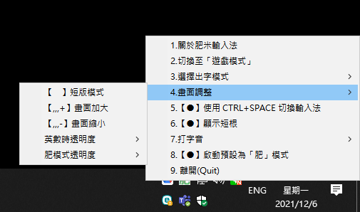
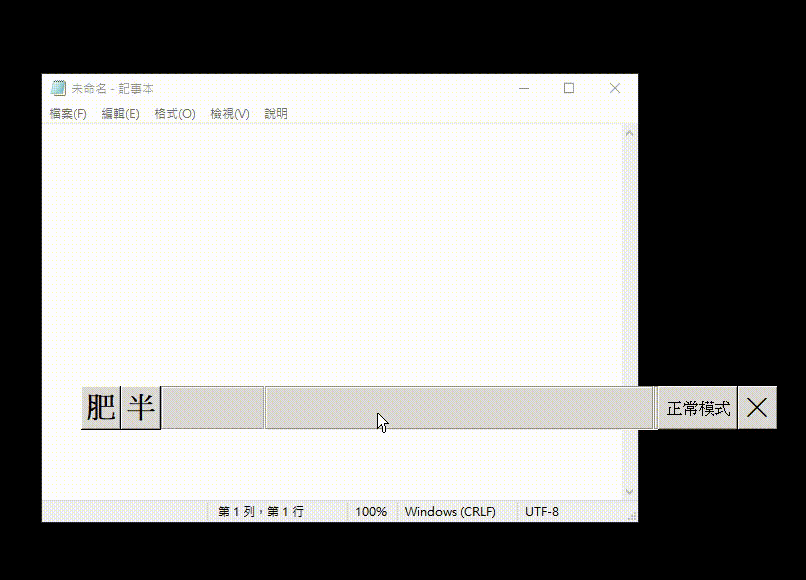
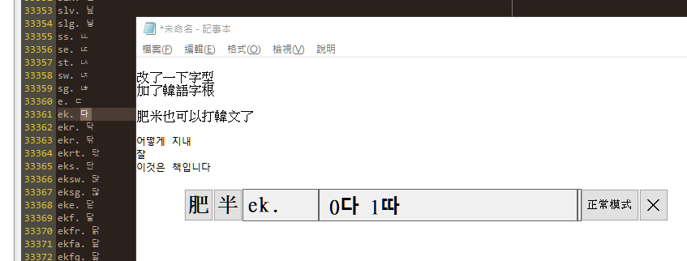
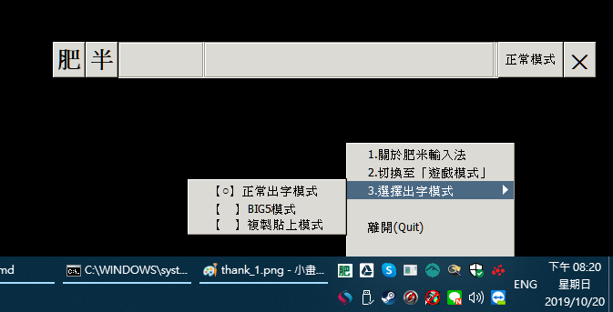

# CHANGELOG (更新記錄)

---

## [v1.68] - 2026-06-15
- **210、Release build 修正**：修正 GitHub Actions 產出的 exe 缺 PyGTK/pywin32 runtime 而無法啟動。
- **211、SHA256 依賴檢查**：CI 使用 `p27/SHA256SUMS.txt` 先驗證 vendored Python 2.7 依賴。
- **212、PyGTK / pywin32 安裝驗證**：CI 會驗證 `gtk/gobject/pango/win32api/pythoncom/pyHook` 可匯入。
- **213、打包內容檢查**：發布前確認 exe 內含必要 PyInstaller entry，避免壞包被上傳。

## [v1.67] - 2026-05-01
- **206、實驗性 TSF Bridge**：解決 Chrome/Edge/VS Code 等程式上字不穩問題。
- **207、自動診斷**：啟動時自動檢查 DLL 狀態，失敗自動 Fallback。
- **208、管理功能**：新增 TSF 管理選單，可隨時註冊或解除註冊。
- **209、權限導引**：新增「以管理員身分重啟」選單功能。
- **病毒碼掃描**：https://www.microsoft.com/en-us/wdsi/submission/464890a2-68c0-4cd7-83ae-5205ed0ecea4

## [v1.66] - 2025-12-23
- **205、標題適配**：chrome 瀏覽 term.ptt.cc 有時標題會變成 ws.ptt.cc，導致出字失敗。

---

## 📅 完整歷史記錄 (由近到遠)

<pre>
(2026-06-15) v1.68 版：
1. 210、修正 GitHub Actions release exe 缺 PyGTK/pywin32 runtime 而無法啟動
2. 211、加入 p27 vendored dependency SHA256 gate
3. 212、CI 安裝 PyGTK、pywin32、pyHook 後逐一驗證 import
4. 213、發布前檢查 exe 內含 gtk/gobject/pango/pyHook/win32api/pythoncom

(2026-05-01) v1.67 版：
病毒碼提交掃描：1.67
1. 206、加入實驗性 TSF Bridge 出字模式，可在右下角選單切換「TSF出字模式」
2. 207、啟動時協助檢查 TSF Bridge DLL 與註冊狀態，出字失敗會自動 fallback 原本 senddata 流程
3. 208、右下角選單加入「TSF Bridge 管理」，可解除註冊 TSF Bridge
4. 209、若為非系統管理員模式，右下角選單加入「以系統管理員身分執行肥米」，點擊後以系統管理員身分重新啟動 

(2025-12-23) v1.66 版：
病毒碼提交掃描：1.66
https://www.microsoft.com/en-us/wdsi/submission/4fe236ae-c9de-4433-8124-620704f41ab4
1. 205、chrome 瀏覽 term.ptt.cc 有時標題會變成 ws.ptt.cc，導致出字失敗

(2025-10-30) v1.65 版：
病毒碼提交掃描：1.65    
https://www.microsoft.com/en-us/wdsi/submission/332e9d30-1a4a-4ec5-832e-4752ac049363
1. 198、自定詞庫字體顯示支援「🅅 U+1F145」、「☒ U+2612」
2. 199、自定詞庫視窗左上角，顯示「肥」Icon
3. 200、關於肥米輸入法，左上角，顯示「肥」Icon
4. 201、「,,,BOX」 可以啟動「自定詞庫」
5. 202、「自定詞庫」最多只能開啟一個視窗，已存在就不顯示
6. 203、避免重複開 關於肥米說明 視窗
7. 204、 如果是肥米的「自定詞庫編輯器」，強制使用複製貼上出字

(2025-09-11) v1.64 版：
病毒碼提交掃描：1.64    
https://www.microsoft.com/en-us/wdsi/submission/04da7699-bdaa-46f5-9008-babee1487dac
1. 194、特殊字「𠫕」在介面顯示的狀況 #61 https://github.com/shadowjohn/UCL_LIU/issues/61 By Benson9954029
2. 195、當特殊字「𠫕」手動新增在自定字區，使用 zuav 出現亂碼的問題 #61 https://github.com/shadowjohn/UCL_LIU/issues/61 By Benson9954029
3. 196、自定詞庫功能 如果定義如 ucl、UCL 可以允許寫到原本的字根後面，如 0肥 1肥宅1 2肥宅2，大小寫也有問題，字根統一小寫
4. 197、自定詞庫功能 字根只能允許 a-z,.]['

(2025-08-10) v1.63 版：
病毒碼提交掃描：1.63
https://www.microsoft.com/en-us/wdsi/submission/30d4454a-c369-41dc-87fd-d071cef06d68
1. 77、自定詞庫功能初步完成，設定完後會增加「custom.json」
   

(2025-06-22) v1.62 版：
病毒碼提交掃描：1.62
https://www.microsoft.com/en-us/wdsi/submission/f156b2c5-3079-4dd0-ae35-8a8c17803124
1. 193、fix short mode display #59 https://github.com/shadowjohn/UCL_LIU/pull/59 By Benson9954029

(2023-11-01) v1.61 版：
病毒碼提交掃描：1.61
https://www.microsoft.com/en-us/wdsi/submission/a6dbc4b2-48a8-4a79-b873-e3756ee21a76
1. 在 uclliu.pyw 加入作者 Benson9954029
2. 188、當輸入 h backspace 1 仍會出現 时，輸入 v backspace 0 仍出現 0 (感謝 Benson9954029 回報、修正問題)
   Issue: <a href='https://github.com/shadowjohn/UCL_LIU/issues/50'>#50</a>
3. 189、时(h1 提示根有 hv、h1) ，但 hv 實際是另一個字根「惟」(感謝 Benson9954029 回報)
4. 190、輸入簡體字時，注音提示沒顯示 https://github.com/shadowjohn/UCL_LIU/issues/52
5. 191、Excel 裡開發者模式，Microsoft Visual Basic for Applications 上字用 big5 貼上模式(感謝 Gstar 回報)
6. 192、韓語字根在 liu.json 裡有些 key 是大寫，載入時改全小寫再使用，如：녕 sUd.	

(2023-11-01) v1.60 版：
病毒碼提交掃描：1.60
https://www.microsoft.com/en-us/wdsi/submission/360b0383-d01c-4670-9df7-70f86b8886b5
1. 187、在使用特殊鍵盤時，有時希望停用 Shift+Space 切換全形、半形字方便使用，增加選單開關 (感謝 Benson9954029 回報、修正問題) 
   Issue: <a href='https://github.com/shadowjohn/UCL_LIU/issues/48'>#49</a>

(2023-06-12) v1.59 版：
病毒碼提交掃描：1.59
https://www.microsoft.com/en-us/wdsi/submission/89ab64f1-0878-423a-ad36-2c9b6b9e67a7
1. 186、當「控制台-地區」使用「Beta: 使用 Unicode UTF-8 提供全球語言支援」會發生 Failed to execute script uclliu 問題 (感謝 robert820 回報問題)
不過若勾選 「Beta: 使用 Unicode UTF-8 提供全球語言支援」，右下角選單會改成英文選單，中文發生亂碼，尚無法解決

(2023-06-12) v1.58 版：
病毒碼提交掃描：1.58
https://www.microsoft.com/en-us/wdsi/submission/c5afc19a-8f2a-4c32-83f7-89325e5a9a20
https://www.microsoft.com/en-us/wdsi/submission/246a2f67-ca34-43b0-851d-aab755124e48 (Debug)
1. 185、按 a 再按 Backspace 再按 Space 預期應該出現空白 但會出現 "對" (感謝 Benson9954029 回報、修正問題)

(2023-05-15) v1.57 版：
病毒碼提交掃描：1.57
https://www.microsoft.com/en-us/wdsi/submission/b2a916e9-c421-448f-8afa-683c126b3423	
1. 183、按 Ctrl + Alt + Del 後，如果在肥模式，回到視窗沒按 Ctrl 輸入法會失靈 (感謝 Benson9954029 回報問題)
2. 184、windows 沙箱在 1.55 版以後無法使用，發現是沙箱缺少 wmic.exe 指令 (感謝 Benson9954029 回報問題)

(2023-05-15) v1.56 版：
病毒碼提交掃描：1.56
https://www.microsoft.com/en-us/wdsi/submission/696cf949-2a3c-42cd-b88a-53a35e3a2460
1. 182、Win11 裡的 notepad 需為特定版本：11.23* 才會改成強制複製貼上

(2023-04-06) v1.55 版：
病毒碼提交掃描：1.55
https://www.microsoft.com/en-us/wdsi/submission/328cc8ac-1cbd-4a3a-beb7-aa1d22ae22ff
1. 177、Win11 裡的 notepad 如果不改字型為 MingLiu 無法正常出字，改成強制複製貼上修正 (感謝 ym 回報問題)
2. 178、隱藏查找 windows 版本時，外部指令顯示視窗問題
2. 179、當按下 ,,,x、,,,z 如果使用者設簡體字，就以簡體字模式轉出，反正就正體字
3. 180、關掉 ,,,x、,,,z 複製貼上等內容，有點不穩定
4. 181、Win11 裡的 notepad 需為特定版本：11.2302.26.0 才會改成強制複製貼上

(2023-02-21) v1.54 版：
病毒碼提交掃描：1.54
https://www.microsoft.com/en-us/wdsi/submission/8b235a03-e2da-4a59-bd8e-70290960441e
1. 175、當使用者按 Win+L 登出系統，再次登入 Windows 會無法正常打字 (感謝 hrcspkla 回報問題)
2. 176、貼上模式時，如 'pns空白2 的擬，會變成 鏦的問題 (感謝 ym 回報問題)

(2023-02-18) v1.53 版：
病毒碼提交掃描：1.53
https://www.microsoft.com/en-us/wdsi/submission/bb57c62a-6cf4-461c-8485-82834943feff
https://www.microsoft.com/en-us/wdsi/submission/6b6524e1-55dd-45f2-aaf6-b8671a602e63
1. 170、修正「設定->應用程式與功能」裡「搜尋清單程式」輸入文字無法正確出字的問題  ( 感謝 ym 回報問題 )
2. 171、網友 Allen 希望肥米打出文字後，可以提示「注音怎麼念」
3. 172、修正 CJK 字型顯示，加入 Serif 字型，可顯示❤❥(,ha)等字
4. 173、修正 my18n.py 未翻譯文字

(2023-01-20) v1.52 版：
病毒碼提交掃描：1.52
https://www.microsoft.com/en-us/wdsi/submission/22968587-5c7a-45aa-8727-cf6757a445bc
1. 168、Rimworld RimWorldWin64.exe 以複製貼上方式上字
2. 169、Neovim(nvim-qt)裡，「停」、「作」無法正常出字的問題修正(感謝 Benson9954029 提交修正程式碼)

(2022-12-18) v1.51 版：
病毒碼提交掃描：1.51
https://www.microsoft.com/en-us/wdsi/submission/03c484f4-d931-4abe-acff-31e5c84cd807
1. 165、注音輸入模式，「ㄒㄧㄤ」襄，選不到
2. 166、注音輸入模式，輸入的注音順序要防呆、置換
3. 167、按 Esc 消除字，但也要同時消除已查到的待選字，如: ucl 打完後，直接按 esc 但按 space 仍會出現肥

(2022-12-10) v1.50 版：
病毒碼提交掃描：1.50
https://www.microsoft.com/en-us/wdsi/submission/cee634bb-e4c3-401e-a302-7b2bf66b8f45
1. 164、Neovim(nvim-qt)，輸入「停」會變「\」

(2022-12-02) v1.49 版：
病毒碼提交掃描：1.49
https://www.microsoft.com/en-us/wdsi/submission/282872c8-9f83-4a8c-a630-c891fe8a381e
1. 162、自定詞，超過一個字以上，不需顯示簡根
2. 163、英文版 Win11 右下角選字中文字顯示異常
修正方式暫時沒有好方法，加入 myi18n.py 若系統非 cp950，則在右下角選單，自動切換成英文選單

(2022-09-18) v1.48 版：
病毒碼提交掃描：1.48
https://www.microsoft.com/en-us/wdsi/submission/2fed6acb-ae30-48d4-85ee-44de1b4c8bbc	
1. 160、修正 f_pass_app 以小寫字比對，修正 uclliu.ini send_kind_3_noucl 裡 Cyberpunk2077.exe 沒比對到的問題
		上禮拜看完 Netflix《電馭叛客：邊緣行者》，回夜城回味一下，發現肥米會被觸發，原來是比對啟動程序大、小寫的關係，順手修正
	目前遊戲沒連網，還不用打字輸入，輸入法暫不使用
2. 161、更新說明網址 http://3wa.tw 為 https://3wa.tw

(2022-09-02) v1.47 版：
病毒碼提交掃描：1.47
https://www.microsoft.com/en-us/wdsi/submission/5f594d53-98b7-477f-b1bd-4574726dbcaa
1. 157、簡根出字內容提示修正 感謝 Benson9954029 提交修正程式碼
  From: https://github.com/shadowjohn/UCL_LIU/pull/25
2. 158、,,,z 在轉「所以我说那个酱汁呢，小当家你是在...」，簡轉繁時，「家」會變「傢」的問題，或是「天后->天後」，嘗試用 opencc改 解決
  加入 OpenCC改，協助 簡轉繁 
  From: https://github.com/yichen0831/opencc-python
  內容來自 pip2 install opencc 後 C:\Python27\Lib\site-packages\opencc	
3. 159、,,,z 在取框選文字後，關閉剪貼簿			

(2022-08-09) V1.46 版：
病毒碼提交掃描：1.46
https://www.microsoft.com/en-us/wdsi/submission/e1ae841b-4c16-4608-bf57-5a2afa9d4a0e
1. 156、肥米的 UI 有機會沉到 taskbar 以下

(2022-06-24) V1.45 版：
病毒碼提交掃描：1.45
https://www.microsoft.com/en-us/wdsi/submission/d303712c-cb9a-4f99-8b50-59347b1222b2
1. 155、瀏覽器開 https://chrome.google.com/ 無法正常打中文的問題

(2022-06-24) V1.44 版：
病毒碼提交掃描：1.44    
https://www.microsoft.com/en-us/wdsi/submission/ac35171b-9d2f-4418-b8e7-2207f93635e3            
1. 154、修正使用 Opera 上 term.ptt.cc 無法打中文的問題

(2022-06-22) V1.43 版：
病毒碼提交掃描：1.43    
https://www.microsoft.com/en-us/wdsi/submission/904ff1d5-169c-4190-a676-405df0f8bbaf            
1. 153、同音字查詢時，顯示順序優先問題，如：閒 'mue 不應該是「見」讀音優先，以「閒」出現順位較前面的優先

(2022-06-21) V1.42 版：
病毒碼提交掃描：1.42
https://www.microsoft.com/en-us/wdsi/submission/e82b3ada-c472-4156-b75e-e4ab87d1e48d            
1. 在 Windows 11 時，修正 chrome、edge、brave 開 term.ptt.cc 無法正常打字的問題

(2022-03-05) V1.41 版：
病毒碼提交掃描：1.41
https://www.microsoft.com/en-us/wdsi/submission/ecbd9e8a-06b3-4af2-8047-ebb53ca721b2        
1. 151、新、舊繁簡對照表，補「拚(拼)」：hanziconv (2705字)

(2022-02-26) V1.40 版：
病毒碼提交掃描：1.40
https://www.microsoft.com/en-us/wdsi/submission/4130bb80-2556-48e4-b68a-ec5d5afdcb2a    
1. 150、VERSION 原本 Float 改成 String
2. 148、左鍵點右下角的「肥」，也可以打開選單，參考：https://github.com/Infinidat/infi.systray/issues/35
3. 149、繁轉簡，有些字沒出現，如「嘆->叹」，参考：https://github.com/shadowjohn/UCL_LIU/issues/18
stts.py 裡原先使用台灣碼農的繁簡對照表，發現有缺漏字(2553字)，改使用：hanziconv (2704字)
https://github.com/berniey/hanziconv/blob/master/hanziconv/charmap.py

(2021-12-02) V1.39 版：
病毒碼提交掃描：1.39
https://www.microsoft.com/en-us/wdsi/submission/4c0c1b31-8330-4837-81e5-8189f8a862fa
1. 100、打字聲音可以調整大小聲
2. 143、在全形模式時，右邊數字鍵 Num Lock、左邊 Scroll Lock 無法正常切換燈號       
3. 144、英數時的透明度讓使用者自定
4. 145、打字音只改用一個執行緒
5. 146、打字音量，可以在選單裡選擇
6. 147、短版模式、長版模式可以在選單裡選擇
            

(2021-08-31) V1.38 版：
病毒碼提交掃描：1.38
https://www.microsoft.com/en-us/wdsi/submission/68bb7af9-532a-44e0-b9cb-e47e788c7378
1. 138、肥米輸入法如果使用中文路徑，右下角icon會出不來
2. 139、如果可以隱藏或不產生 icon.ico 檔
3. 135、https://www.csie.ntu.edu.tw/~b92025/liu/ 裡的 liu-uni.tab 異常，利用 MD5 排除
4. 142、切換「肥/英」應該把後選字的記憶體清空 (約 1194 行)
5. 136、注音查詢功能 (需重新下載 https://github.com/shadowjohn/UCL_LIU/blob/master/dist/pinyi.txt)

肥米輸入法可以使用注音查字嘍

(2021-08-08) V1.37 版：
病毒碼提交掃描：1.37 
https://www.microsoft.com/en-us/wdsi/submission/6401cdef-aea5-4490-a1f1-f9d511bd9b29
1. 127、將簡、繁轉檔函式獨立成 stts.py
2. 128、打字音打太快當機問題修正
3. 129、打字音按著鍵會連續音消除
4. 130、打字音按鍵支援 space、enter、delete、backspace 聲音
5. 131、批踢踢實業坊 - Google Chrome 改成強制 paste 模式
6. 132、連 term.ptt.cc 不同瀏覽器標題不同
	Chrome：批踢踢實業坊 - Google Chrome
	Brave：批踢踢實業坊 - Brave
	Edge：批踢踢實業坊 - 個人 - Microsoft? Edge
	Firefox：批踢踢實業坊 — Mozilla Firefox
7. 126、Ctrl + Space 模式，Shift + Space 按著 Shift 無法連續切換「全、半」 # 約 2048 行
8. 133、加上預設啟動為英/半的參數 (startup_default_ucl=1)
9. 125、右下角選單會被摭檔
	摭檔改使用 traybar.py、win32_adapter.py
	# From : https://github.com/Infinidat/infi.systray    
	# From : https://github.com/gevasiliou/PythonTests/blob/master/TrayAllClicksMenu.py
10. 134、編譯階段移除用不到的pyd，可省一點點exe空間

(2021-07-27) V1.36 版：
病毒碼提交掃描：1.36 
https://www.microsoft.com/en-us/wdsi/submission/24eefe41-3b43-4324-bc31-b5a56a568bb4
https://www.microsoft.com/en-us/wdsi/submission/798cb938-a746-4e0c-acb6-09f6919e2029
1. 123、開啟時，超出螢幕視窗範圍異常，改用各自螢幕範圍偵測
2. 124、修正半途拔插螢幕、改變螢幕位置識別區，輸入框位置自動修正

(2021-07-22) V1.35 版：
病毒碼提交掃描：1.35 https://www.microsoft.com/en-us/wdsi/submission/8b3ea446-54a3-4c86-8a8c-0ea18f6617c8
1. 121、修正 array_remove_empty_and_trim 異常     

(2021-07-22) V1.34 版：
病毒碼提交掃描：1.34 https://www.microsoft.com/en-us/wdsi/submission/61c84515-3890-4e51-be52-ab24e8024c93
1. 117、當點右下角「肥」叫出選單，應該把「肥」切換成「英」，以免檔到畫面。
2. 118、顯示短根，因為分頁的關係故障，如果不是透過選字，不會出現短根，例如：肥 ucl 空白，跟 ucl 0，按 ucl 0 才出現短根
3. 119、send_kind_1_paste、send_kind_2_big5 ... 出字方式的執行檔名，要 trim，避免使用者多打了空白、過濾重複值
4. 120、當點右下角「肥」叫出選單，應該把「全」切換成「半」，以免檔到畫面。

(2021-07-03) V1.33 版：
病毒碼提交掃描：1.33 https://www.microsoft.com/en-us/wdsi/submission/a85a1285-faeb-4bb7-a28d-2e850b2c63ea
1、vncviewer.exe，不用切換中文
2、可以在 UCLLIU.ini 裡設定 send_kind_3_noucl ，需強制 英/半 的軟體，逗號分格，例如 vncviewer.exe,teamviewer.exe
3、自定詞庫、符號，選字分頁的問題，例如：,a，或 ,x ，有多頁時，可用 shift + space 換頁

(2021-03-22) V1.32 版：
病毒碼提交掃描：1.32 https://www.microsoft.com/en-us/wdsi/submission/5149f240-117d-48fe-8231-fbb9e1b43ecd
1、修正 英/全 在使用 ctrl+c、ctrl+v 這類的組合鍵異常的問題
		   
(2021-03-21) V1.31 版：
病毒碼提交掃描：1.31 https://www.microsoft.com/en-us/wdsi/submission/150a4bf2-f22c-4b3a-bfe0-f6e10dd5e2e3
1、修正 rime 字根表 liur_Trad.dict.yaml 轉 cin 漏字的問題
2、修正 rime 字根表有些字根是 ~ 開頭，如 備、刪
(2018-04-21) 補充說明：
因為最近在使用，發現肥米自己關閉，然後整個exe檔消失，查了一下發現被 Windows Defender 誤判為病毒了
Trojan:Win32/Fuery.A!cl、HackToo:Win32/Keygen
就把uclliu.exe上傳至微軟自清送驗~
https://www.microsoft.com/en-us/wdsi/submission/70669843-8642-4b61-bdb2-561243f78af6
等了約1小時，就收到 Final determination : Not malware     

(2021-03-20) V1.30 版：
病毒碼提交掃描：1.30 https://www.microsoft.com/en-us/wdsi/submission/287899c5-5244-4a2f-a4e9-3c24f7ac3216
1、電馭叛客2077，按 shift 應該無效化，遊戲中不用切換中文
2、滑鼠事件造成lag與beep聲問題處理
3、CTRL+SPACE也可以切換輸入法
4、加入 metadata 應用程式詳細說明
5、pyaudio 改成要使用時才 import 細節

(2020-10-08) V1.29 版：
病毒碼提交掃描：1.29 https://www.microsoft.com/en-us/wdsi/submission/8d30cbe3-a2a0-47be-a5e0-7b00f5841e75
1、修正 exit 離開會當機的問題
2、修正自行編譯 pyhook 發佈失敗的問題

(2020-10-03) V1.28 版：
1、修正分頁的內容，如：
	分頁異常，範例：'hdfu 慢，最後一頁會無法回到第一頁
	分頁異常，範例：'gtn 某，本來有三個字，只顯示了二個字的問題
2、修改 pango 字型，允許韓語字型 Malgun Gothic
 

(2020-07-01) V1.27 版：
病毒碼提交掃描：1.27 https://www.microsoft.com/en-us/wdsi/submission/e074cf5b-dc2c-40a2-9e6a-45360f497ea8
1、SP短字根，可以記憶到UCLLIU.ini
2、打字音的開關，可以記憶到UCLLIU.ini   

(2020-05-24) V1.26 版：
病毒碼提交掃描：1.26 https://www.microsoft.com/en-us/wdsi/submission/1c376497-eabe-45f0-b100-36590351ca39
1、同目錄下 1.wav ~ 9.wav 為隨機打字音檔，目錄下任意 wav 都可以讀入
2、增加打字音勾選功能
3、可以在 UCLLIU.ini 中調整打字音量，KEYBOARD_VOLUME 0~50
4、打字聲音檔：https://raw.githubusercontent.com/shadowjohn/UCL_LIU/master/wavs/wavs.zip 下載後解開，0~9.wav 與 uclliu.exe 放一起即可

(2019-12-03) V1.25 版：
病毒碼提交掃描：1.25 https://www.microsoft.com/en-us/wdsi/submission/b7810d0b-cbf5-4710-adb9-bc2a7594d189
1、修正 Photoimpact 8、photoimpact X3 無法輸入中文的問題
2、(可開關)中文出字後，自動提示最短根

(2019-10-26) V1.24 版：                                                                          
病毒碼提交掃描：1.24 https://www.microsoft.com/en-us/wdsi/submission/2d8f7570-fd3d-4c3e-9869-331f2f75565e
1、修正肥米雙螢幕時，可以在不同螢幕中拖移

(2019-10-22) V1.23 版：
病毒碼提交掃描：1.23 https://www.microsoft.com/en-us/wdsi/submission/725eeb8a-22cc-42a4-aad2-55f55a4ac13a
1、修正肥米的視窗，不會超出螢幕
2、按著 Shift 框字時，不會改變 英/肥 的狀態

(2019-10-20) V1.22 版：
病毒碼提交掃描：1.22 https://www.microsoft.com/en-us/wdsi/submission/1b5d942a-6d11-4d14-907a-3a3ba13b1d63
增加右下角 Trayicon 點開功能，允許使用正常出字、BIG5出字、貼上出字
使用貼上出字，可以修正 https://term.ptt.cc/ 無法正常輸入中文的問題
把 UCLLIU.lock 從 C:\temp 搬到與執行程式同階

(2019-07-19) V1.21 版：
病毒碼提交掃描：1.21 https://www.microsoft.com/en-us/wdsi/submission/377fd3c3-f176-46bf-b532-4da5dddb9d60
在肥模式，輸入字大於 1 以上，按下 esc 鍵，只作刪除所有字根功能。        

(2019-05-17) V1.20 版：
病毒碼提交掃描：1.20 https://www.microsoft.com/en-us/wdsi/submission/ad55d07c-5a7d-44fe-85f1-db7d3e779f3a    
讓使用者可以自定二種出字的方法。
修正元「點金靈」軟體無法出字的問題。

(2019-04-25) V1.18、V1.19 版：
病毒碼提交掃描：1.18 https://www.microsoft.com/en-us/wdsi/submission/9de232c0-7640-4f9c-8a22-578aa3c218be
病毒碼提交掃描：1.19 https://www.microsoft.com/en-us/wdsi/submission/1d1895a2-ce1b-4099-b14e-3b5147f34836
支援微軟遠端連線，連外部主機時，本機強制使用「英/半」，不會一直彈出來煩。
支援Chrome遠端連線，連外部主機時，本機強制使用「英/半」，不會一直彈出來煩。

(2019-04-13) V1.17 版：
病毒碼提交掃描：https://www.microsoft.com/en-us/wdsi/submission/a3f661ad-7684-42f5-ab5f-6b40e8cbeadd
支援小小輸入法臺灣包2018年版wuxiami.txt，http://fygul.blogspot.com/2018/05/yong-tw2018.html 裡linux包中的/tw/wuxiami.txt
支援opendesktop提供的萬國蝦米字根檔uniliu.txt，https://github.com/chinese-opendesktop/cin-tables (同fcitx_boshiamy.txt)

(2019-03-21) V1.16 版：
病毒碼提交掃描：https://www.microsoft.com/en-us/wdsi/submission/f24a0ff0-4975-4ae6-b6c1-40f1d58f5de6
修正康和金好康看盤軟體出中文字的問題
修正將肥米放入Windows啟動排程，找不到 liu.json 的問題      

(2019-03-06) V1.15 版：
病毒碼提交掃描：https://www.microsoft.com/en-us/wdsi/submission/99fc1c91-f672-4d69-9d2a-b50ab74fe8b2
CapsLock + Backspace 優先刪除 肥模式 打出來的字根
CapsLock + Shift 也是穿透

(2019-03-02) V1.14 版：
病毒碼提交掃描：https://www.microsoft.com/en-us/wdsi/submission/e5cb4092-479b-4188-9978-dea9db49b5ba
「英/全」時的 ESC 鍵沒有正常的吐出 ESC 的問題，如無法關閉 Line 視窗
「肥」模式時，按到按鍵會造成浮起，要增加判斷只有0-9，A-Z才需要
UCLLIU.ini 跟在 uclliu.exe 旁  
自定詞庫有空白的字詞時，若有空白，會黏在一起的問題
自定詞庫有空白的字詞時，若有()，會消失的問題
自定詞庫有斷行的字詞時，能自動斷行
CapsLook + 任意鍵直接穿透
修正遊戲「缺氧」打中文字的問題
	
(2018-07-14) V1.13 版：
修正 kinza 瀏覽器裡 ptt 打字無法正常的問題

(2018-07-12) V1.12 版：
可紀錄最後 UI 擺放的位置在 C:\temp\UCLLIU.ini
增加使用 ,,,s 將肥米 UI 變窄
增加使用 ,,,l 將肥米 UI 變寬
增加使用 ,,,+ 將肥米 UI 變大
增加使用 ,,,- 將肥米 UI 變小
UCLLIU.ini 裡 ZOOM 可設定 0.1 ~ 1.0 來改變 肥 模式下透明度    

(2018-07-12) V1.11 版：
可以使用 ,,,c、,,,t 來切換「簡體/繁體」輸入。 
感謝臺灣碼農的簡繁對照表 https://ithelp.ithome.com.tw/articles/10196695

(2018-07-09) V1.10 版：
移除用不到的 win32com、win32com.client ，執行檔變小
加速、修正 ,,,x、,,,z 使用 thread 來出字，防止多按一個 z 或 x 的問題
修正 ,,,x 大小寫都可以使用 

(2018-07-04) V1.9 版：
增加 ,,,x 與 ,,,z 的功能，在「肥」模式下，反白文字：
利用 ,,,x 可以將「文字→字根」，如「肥的好→ucl d gz」
利用 ,,,z 可以將「字根→文字」，如「ucl d gz→肥的好」    
(2018-07-06) 補充說明：
微軟的　Windows Defender 更新後誤判程式是病毒，詳見：screenshot/uclliu_save1.png
已提交，判定為 Not malware ，真麻煩 :(
	
(2018-06-25) V1.8 版：
支援RIME afrink 分享的 liur_trad.dict.yaml 字根表

(2018-05-08) V1.7 版：
(修正)正常模式的字體初始時大小錯誤         

(2018-05-05) V1.6 版：
(修正)右邊數字鍵的 . 直接輸出即可
(修正)移除uclliu_debug，改用 -d 即可進入 debug 模式
調整 UI 顯示字型大小

(2018-04-11) V1.5 版：
將「英/半」的半透明無置頂，改成置「底」，其他狀況「置頂」
改寫gtk.main() 改成 gtk.main_iteration(False) 來處理 UI 更新
(感謝老炳幫忙測置頂的bug)    

(2018-04-08) V1.4 版：
支援 Terry_Yong 的 泰瑞版小小輸入法，將 terry_yong.zip 解開，資料夾 mb 裡的 Boshiamy.txt 改名成 terry_boshiamy.txt 跟主程式放一起，
就可以把terry_boshiamy.txt 轉成 liu.cin，再轉 liu.json 來使用。
此版本筆者測試後，發現無日文，如果不需使用日文是勘用。             

(2018-04-05) V1.3 版：
修正 putty 在 vim 時，打中文無法正常出字的問題

(2018-03-27) V1.2 版：
修正「英/全」一些按鍵如 win、ctrl、enter 等問題
將 cintojson.py 整支重寫，改成此輸入法需要的部分，初始化 cin -> json 速度就不會像以前那麼慢了!    

(2018-03-22) V1.2 版，可支援 fcitx 裡的嘸蝦米表格：
fcitx-table-boshiamy，如要使用fcitx-table-boshiamy，下載 boshiamy.txt 改名成 fcitx_boshiamy.txt 跟主程式放一起，
就可以把fcitx_boshiamy.txt 轉成 liu.cin，再轉 liu.json 來使用。
我加了點程式碼，順手把日文的部分修正，原本打 a, = あ，但在 fcitx 要打 ja, 才會出 あ，如果只有打 a, 好像有些亂碼~_~
反正就修正了~
</pre>
