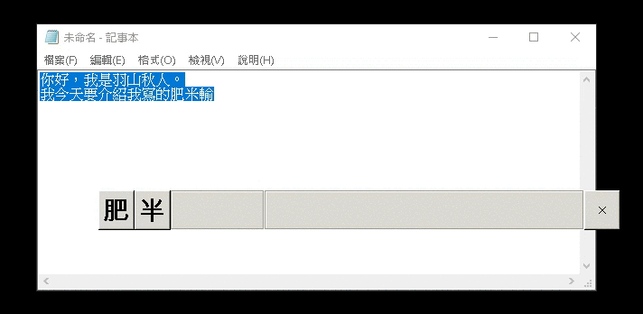
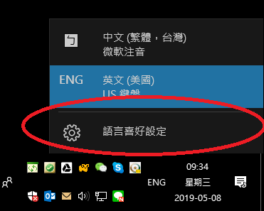
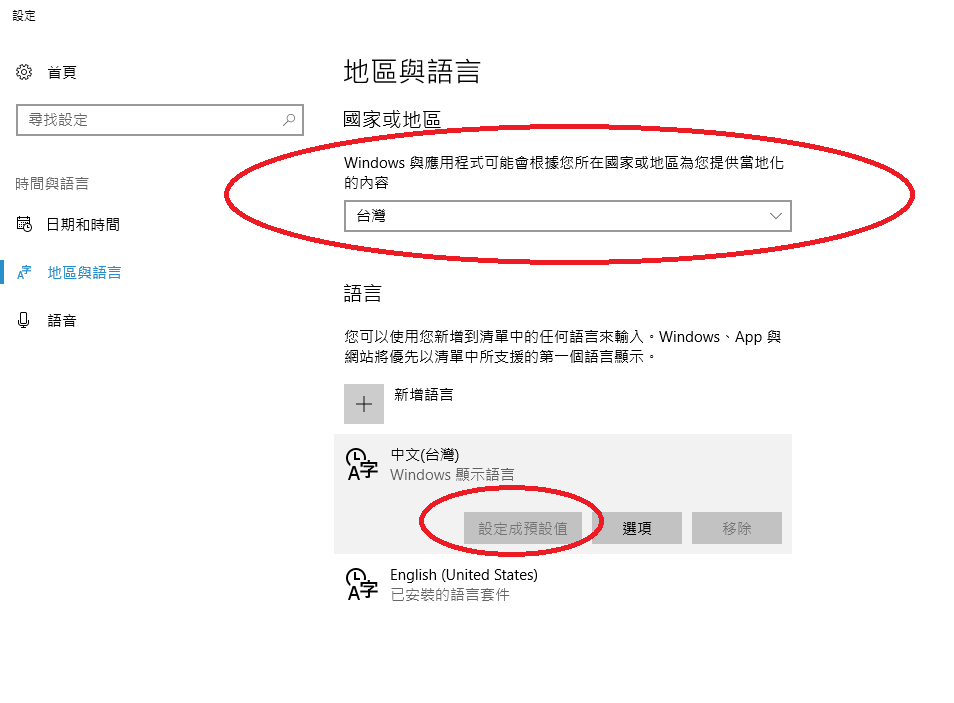
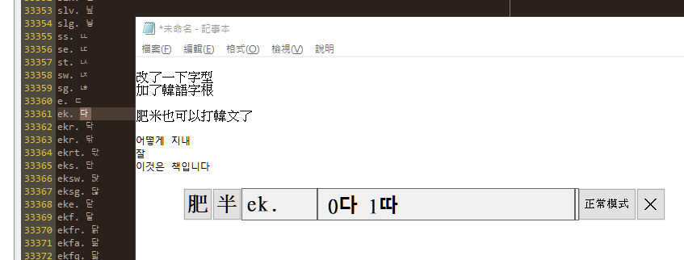
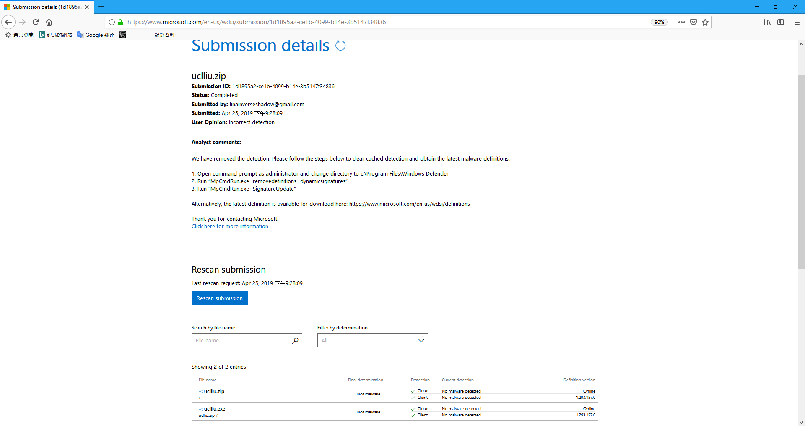

# UCL_LIU
利用python+pyhook開發的仿蝦米，肥米輸入法 
 

  
   
  https://youtu.be/ClSbkHDqkOs
   
  加入鍵盤打字聲

 
<h3>作者：</h3>
  羽山秋人 (<a target="_blank" href="https://3wa.tw">https://3wa.tw</a>) 
<h3>信箱：</h3>
  <a target="_blank" href="mailto:uclliu.3wa@gmail.com">uclliu.3wa@gmail.com</a> 
 
<h3>最初開發日期：</h3>2017-06-16 11:24 
<h3>最後更新日期：</h3>2021-03-22 14:31
 
<h3>版本：</h3>V 1.32 
 
<h3>版權：</h3>
　免錢的 MIT-License
 
<h3>下載位置：</h3>
　　1.主程式：<a download="uclliu.exe" target="_blank" href="https://raw.githubusercontent.com/shadowjohn/UCL_LIU/master/dist/uclliu.exe">https://raw.githubusercontent.com/shadowjohn/UCL_LIU/master/dist/uclliu.exe</a> 
　　2.歷年版本：<a target="_blank" href="https://github.com/shadowjohn/UCL_LIU/tree/master/RELEASE">歷代版本</a> 
　　3.同音字庫：<a download="pinyi.txt" target="_blank" href="https://raw.githubusercontent.com/shadowjohn/UCL_LIU/master/dist/pinyi.txt">https://raw.githubusercontent.com/shadowjohn/UCL_LIU/master/dist/pinyi.txt</a> 
　　4.打字聲音檔：<a download="pinyi.txt" target="_blank" href="https://raw.githubusercontent.com/shadowjohn/UCL_LIU/master/wavs/wavs.zip">https://raw.githubusercontent.com/shadowjohn/UCL_LIU/master/wavs/wavs.zip</a> 下載後解開，0~9.wav 與 uclliu.exe 放一起即可
　　5.字根檔(liu-uni.tab、liu.cin、liu.json) 因版權問題無法提供  
 
 

<h3>使用方法：</h3>
　　1、您可以只下載dist/uclliu.exe 
　　2、將 「liu-uni.tab 或 liu.cin 或 liu.json」任一種檔案 與 uclliu.exe 放一起 
　　3、執行 uclliu.exe 即可開始使用 
　　4、首次執行，系統會自動將tab轉成liu.json，需要花大概30秒~1分鐘的時間，之後有liu.json就可以快速開啟。 
　　5、未來使用的話，就把uclliu.exe、作好的字根檔liu.json帶著走，四處都能打肥米輸入法了 
　　6、下載 pinyi.txt 與 uclliu.exe 放一起執行，同音字庫，如「'pns」，會出現「0你 1妳 2擬 3禰 4儗 5旎...」同音選擇。 
　　(還是要再強調一次，不要用義守大學FTP裡的那個liu-uni.tab，建議可以安裝正版嘸蝦米後在C:\windows\Syswow64裡找到) 
　　7、「正常模式」=「,,,unlock」：平常打字用。 
　　8、「遊戲模式」=「,,,lock」：玩遊戲時用，如CS:GO，需要按著Shift消音走路。 
　　(如果忽然無法打字，也許就是進了「遊戲模式」請按「,,,unlock」解除。) 
　　9、「查看目前版本」=「,,,version」  
　　10、「簡體／繁體」模式 「,,,c」「,,,t」 切換 
　　11、UI 變窄「,,,s」  
　　12、UI 變寬「,,,l」  
　　13、UI 變大「,,,+」  
　　14、UI 變小「,,,-」  
　　15、UCLLIU.ini 
　　　　[DEFAULT] 
　　　　short_mode = 0  # 是否為「短」版模式， 0 或 1 
　　　　zoom = 0.90  # 縮放大小 
　　　　send_kind_2_big5 = # 如 EWinner.exe 遇到此種程式，以 「big5」 方式出字  
　　　　send_kind_1_paste = # 如 putty.exe,pcman 遇到此程程式，以 「複製、貼上」 方式出字  
　　　　alpha = 1 # 透明度 
　　　　y = 950 # 肥米輸入法最後在螢幕 y 軸位置 
　　　　x = 1239 # 肥米輸入法最後在螢幕 x 軸位置 
　　　　SP = 0 # 是否顯示短根， 0 或 1 
　　　　PLAY_SOUND_ENABLE = 0 # 是否有打字音， 0 或 1 
　　16、環境設定(強列建議)： 
<kbd>
 
  <h3>建議可以跟筆者一樣</h3>
</kbd>
<kbd>
 
  <h3>安裝一個「ENG語系」，點選【語言喜好設定】」，應該可以在控制台找到。</h3>
</kbd>
<kbd>
 
  <h3>
一、國家與地區，要選「台灣」 
二、新增語言：找到「English (United States)」加入，但【中文(台灣)要設為預設值】 
三、平常打字時，就選「ENG」打起來就會很順手。 
  </h3>
    17、出字模式選擇： 
<kbd>
<h3>感謝網友 klt 回報，提到使用 https://term.ptt.cc/ 無法正常出字，將出字選擇功能作成自定選擇</h3>
</kbd>
</kbd>
  
 
<h3>開發動機：</h3>
　　吃飽閒閒覺得人生就是該自己寫一套輸入法，然後就開始寫了。 
 
<h3>目前肥米輸入法支援的字碼表如下：</h3>
　　1、官方 7.0.4 liu-uni.tab 
　　2、官方 7.0.5 liu-uni.tab 
　　3、嘸蝦米 J liu-uni.tab 
　　4、PIME liu.json 
　　5、fcitx 嘸蝦米表格，下載 boshiamy.txt 改名成 fcitx_boshiamy.txt 跟主程式放一起(可惜沒有日文字) 
　　6、泰瑞版小小輸入法，將 terry_yong.zip 解開，資料夾 mb 裡的 Boshiamy.txt 改名成 terry_boshiamy.txt 跟主程式放一起 
　　7、RIME afrink 整理的 liur_trad.dict.yaml，liur_trad.dict.yaml 跟主程式放一起 
　　8、支援opendesktop提供的萬國蝦米字根檔uniliu.txt， https://github.com/chinese-opendesktop/cin-tables ，同fcitx 嘸蝦米表格，將uniliu.txt 改名成 fcitx_boshiamy.txt 跟主程式放一起(可惜沒有日文字) 
　　9、支援小小輸入法臺灣包2018年版wuxiami.txt，http://fygul.blogspot.com/2018/05/yong-tw2018.html 裡linux包中的/tw/wuxiami.txt，將wuxiami.txt 跟主程式放一起 
　　10、支援 Bluebat 版 fcitx 嘸蝦米表格，下載 https://github.com/chinese-opendesktop/cin-tables/blob/master/boshiamy.cin 改名成 fcitx_boshiamy.txt 跟主程式放一起(可惜沒有日文字) 
　　11、支援 https://echeck.blogspot.com/2011/06/blog-post.html 韓語字根，把字根下載解壓後，把 ; 改成 . 再複製到自己的 liu.cin 刪除 liu.json 重新執行肥米，即可以輸入韓語字 
           
       
<h3>字碼表說明：</h3>
　　　　由於字碼表的版權問題爭議，就不放 liu.json 了，liu.json 的格式同PIME的架構。 
　　要好的字碼表的話，請買正版，將 tab->cin->json  
　　雖然很麻煩，但沒人想因為實作一套輸入法就被告翻。 
　　 
　　P.S: 請不要使用守義大學FTP裡的那個 liu-uni.tab ，太古早了，而且有些字根都錯的!
　　 
　　首次使用如果沒有liu.json，會自動進行 tab->cin->json的轉換，tab會自動查找C:\windows\Syswow64\liu-uni.tab 或 C:\\Program Files\\BoshiamyTIP\\liu-uni.tab 或 同目錄下的tab檔。 
 
 

    (2018-03-22) V1.2 版，可支援 fcitx 裡的嘸蝦米表格：
    fcitx-table-boshiamy，如要使用fcitx-table-boshiamy，下載 boshiamy.txt 改名成 fcitx_boshiamy.txt 跟主程式放一起，
    就可以把fcitx_boshiamy.txt 轉成 liu.cin，再轉 liu.json 來使用。
    我加了點程式碼，順手把日文的部分修正，原本打 a, = あ，但在 fcitx 要打 ja, 才會出 あ，如果只有打 a, 好像有些亂碼~_~
    反正就修正了~
    
    (2018-03-27) V1.2 版：
    修正「英/全」一些按鍵如 win、ctrl、enter 等問題
    將 cintojson.py 整支重寫，改成此輸入法需要的部分，初始化 cin -> json 速度就不會像以前那麼慢了! 
    
    (2018-04-05) V1.3 版：
    修正 putty 在 vim 時，打中文無法正常出字的問題
    
    (2018-04-08) V1.4 版：
    支援 Terry_Yong 的 泰瑞版小小輸入法，將 terry_yong.zip 解開，資料夾 mb 裡的 Boshiamy.txt 改名成 terry_boshiamy.txt 跟主程式放一起，
    就可以把terry_boshiamy.txt 轉成 liu.cin，再轉 liu.json 來使用。
    此版本筆者測試後，發現無日文，如果不需使用日文是勘用。

    (2018-04-11) V1.5 版：
    將「英/半」的半透明無置頂，改成置「底」，其他狀況「置頂」
    改寫gtk.main() 改成 gtk.main_iteration(False) 來處理 UI 更新
    (感謝老炳幫忙測置頂的bug)
    
    (2018-04-21) 補充說明：
    因為最近在使用，發現肥米自己關閉，然後整個exe檔消失，查了一下發現被 Windows Defender 誤判為病毒了
    Trojan:Win32/Fuery.A!cl、HackToo:Win32/Keygen
    就把uclliu.exe上傳至微軟自清送驗~
    https://www.microsoft.com/en-us/wdsi/submission/70669843-8642-4b61-bdb2-561243f78af6
    等了約1小時，就收到 Final determination : Not malware
    
    (2018-05-05) V1.6 版：
    (修正)右邊數字鍵的 . 直接輸出即可
    (修正)移除uclliu_debug，改用 -d 即可進入 debug 模式
    調整 UI 顯示字型大小
    
    (2018-05-08) V1.7 版：
    (修正)正常模式的字體初始時大小錯誤         

    (2018-06-25) V1.8 版：
    支援RIME afrink 分享的 liur_trad.dict.yaml 字根表

    (2018-07-04) V1.9 版：
    增加 ,,,x 與 ,,,z 的功能，在「肥」模式下，反白文字：
    利用 ,,,x 可以將「文字→字根」，如「肥的好→ucl d gz」
    利用 ,,,z 可以將「字根→文字」，如「ucl d gz→肥的好」
    
    (2018-07-06) 補充說明：
    微軟的　Windows Defender 更新後誤判程式是病毒，詳見：screenshot/uclliu_save1.png
    已提交，判定為 Not malware ，真麻煩 :(

    (2018-07-09) V1.10 版：
    移除用不到的 win32com、win32com.client ，執行檔變小
    加速、修正 ,,,x、,,,z 使用 thread 來出字，防止多按一個 z 或 x 的問題
    修正 ,,,x 大小寫都可以使用 
    
    (2018-07-12) V1.11 版：
    可以使用 ,,,c、,,,t 來切換「簡體/繁體」輸入。 
    感謝臺灣碼農的簡繁對照表 https://ithelp.ithome.com.tw/articles/10196695
    
    (2018-07-12) V1.12 版：
    可紀錄最後 UI 擺放的位置在 C:\temp\UCLLIU.ini
    增加使用 ,,,s 將肥米 UI 變窄
    增加使用 ,,,l 將肥米 UI 變寬
    增加使用 ,,,+ 將肥米 UI 變大
    增加使用 ,,,- 將肥米 UI 變小
    UCLLIU.ini 裡 ZOOM 可設定 0.1 ~ 1.0 來改變 肥 模式下透明度
    
    (2018-07-14) V1.13 版：
    修正 kinza 瀏覽器裡 ptt 打字無法正常的問題
    
    (2019-03-02) V1.14 版：
    病毒碼提交掃描：https://www.microsoft.com/en-us/wdsi/submission/e5cb4092-479b-4188-9978-dea9db49b5ba
    「英/全」時的 ESC 鍵沒有正常的吐出 ESC 的問題，如無法關閉 Line 視窗
    「肥」模式時，按到按鍵會造成浮起，要增加判斷只有0-9，A-Z才需要
    UCLLIU.ini 跟在 uclliu.exe 旁  
    自定詞庫有空白的字詞時，若有空白，會黏在一起的問題
    自定詞庫有空白的字詞時，若有()，會消失的問題
    自定詞庫有斷行的字詞時，能自動斷行
    CapsLook + 任意鍵直接穿透
    修正遊戲「缺氧」打中文字的問題
    
    (2019-03-06) V1.15 版：
    病毒碼提交掃描：https://www.microsoft.com/en-us/wdsi/submission/99fc1c91-f672-4d69-9d2a-b50ab74fe8b2
    CapsLock + Backspace 優先刪除 肥模式 打出來的字根
    CapsLock + Shift 也是穿透
    
    (2019-03-21) V1.16 版：
    病毒碼提交掃描：https://www.microsoft.com/en-us/wdsi/submission/f24a0ff0-4975-4ae6-b6c1-40f1d58f5de6
    修正康和金好康看盤軟體出中文字的問題
    修正將肥米放入Windows啟動排程，找不到 liu.json 的問題      

    (2019-04-13) V1.17 版：
    病毒碼提交掃描：https://www.microsoft.com/en-us/wdsi/submission/a3f661ad-7684-42f5-ab5f-6b40e8cbeadd
    支援小小輸入法臺灣包2018年版wuxiami.txt，http://fygul.blogspot.com/2018/05/yong-tw2018.html 裡linux包中的/tw/wuxiami.txt
    支援opendesktop提供的萬國蝦米字根檔uniliu.txt，https://github.com/chinese-opendesktop/cin-tables (同fcitx_boshiamy.txt)

    (2019-04-25) V1.18、V1.19 版：
    病毒碼提交掃描：1.18 https://www.microsoft.com/en-us/wdsi/submission/9de232c0-7640-4f9c-8a22-578aa3c218be
    病毒碼提交掃描：1.19 https://www.microsoft.com/en-us/wdsi/submission/1d1895a2-ce1b-4099-b14e-3b5147f34836
    支援微軟遠端連線，連外部主機時，本機強制使用「英/半」，不會一直彈出來煩。
    支援Chrome遠端連線，連外部主機時，本機強制使用「英/半」，不會一直彈出來煩。

    (2019-05-17) V1.20 版：
    病毒碼提交掃描：1.20 https://www.microsoft.com/en-us/wdsi/submission/ad55d07c-5a7d-44fe-85f1-db7d3e779f3a    
    讓使用者可以自定二種出字的方法。
    修正元「點金靈」軟體無法出字的問題。

    (2019-07-19) V1.21 版：
    病毒碼提交掃描：1.21 https://www.microsoft.com/en-us/wdsi/submission/377fd3c3-f176-46bf-b532-4da5dddb9d60
    在肥模式，輸入字大於 1 以上，按下 esc 鍵，只作刪除所有字根功能。
    
    (2019-10-20) V1.22 版：
    病毒碼提交掃描：1.22 https://www.microsoft.com/en-us/wdsi/submission/1b5d942a-6d11-4d14-907a-3a3ba13b1d63
    增加右下角 Trayicon 點開功能，允許使用正常出字、BIG5出字、貼上出字
    使用貼上出字，可以修正 https://term.ptt.cc/ 無法正常輸入中文的問題
    把 UCLLIU.lock 從 C:\temp 搬到與執行程式同階
    
    
    (2019-10-22) V1.23 版：
    病毒碼提交掃描：1.23 https://www.microsoft.com/en-us/wdsi/submission/725eeb8a-22cc-42a4-aad2-55f55a4ac13a
    1、修正肥米的視窗，不會超出螢幕
    2、按著 Shift 框字時，不會改變 英/肥 的狀態
    
    (2019-10-26) V1.24 版：                                                                          
    病毒碼提交掃描：1.24 https://www.microsoft.com/en-us/wdsi/submission/2d8f7570-fd3d-4c3e-9869-331f2f75565e
    1、修正肥米雙螢幕時，可以在不同螢幕中拖移
    
    (2019-12-03) V1.25 版：
    病毒碼提交掃描：1.25 https://www.microsoft.com/en-us/wdsi/submission/b7810d0b-cbf5-4710-adb9-bc2a7594d189
    1、修正 Photoimpact 8、photoimpact X3 無法輸入中文的問題
    2、(可開關)中文出字後，自動提示最短根
    
    (2020-05-24) V1.26 版：
    病毒碼提交掃描：1.26 https://www.microsoft.com/en-us/wdsi/submission/1c376497-eabe-45f0-b100-36590351ca39
    1、同目錄下 1.wav ~ 9.wav 為隨機打字音檔，目錄下任意 wav 都可以讀入
    2、增加打字音勾選功能
    3、可以在 UCLLIU.ini 中調整打字音量，KEYBOARD_VOLUME 0~50
    4、打字聲音檔：https://raw.githubusercontent.com/shadowjohn/UCL_LIU/master/wavs/wavs.zip 下載後解開，0~9.wav 與 uclliu.exe 放一起即可
    
    (2020-07-01) V1.27 版：
    病毒碼提交掃描：1.27 https://www.microsoft.com/en-us/wdsi/submission/e074cf5b-dc2c-40a2-9e6a-45360f497ea8
    1、SP短字根，可以記憶到UCLLIU.ini
    2、打字音的開關，可以記憶到UCLLIU.ini
    
    (2020-10-03) V1.28 版：
    1、修正分頁的內容，如：
        分頁異常，範例：'hdfu 慢，最後一頁會無法回到第一頁
        分頁異常，範例：'gtn 某，本來有三個字，只顯示了二個字的問題
    2、修改 pango 字型，允許韓語字型 Malgun Gothic
     

    (2020-10-08) V1.29 版：
    病毒碼提交掃描：1.29 https://www.microsoft.com/en-us/wdsi/submission/8d30cbe3-a2a0-47be-a5e0-7b00f5841e75
    1、修正 exit 離開會當機的問題
    2、修正自行編譯 pyhook 發佈失敗的問題
    
    (2021-03-20) V1.30 版：
    病毒碼提交掃描：1.30 https://www.microsoft.com/en-us/wdsi/submission/287899c5-5244-4a2f-a4e9-3c24f7ac3216
    1、電馭叛客2077，按 shift 應該無效化，遊戲中不用切換中文
    2、滑鼠事件造成lag與beep聲問題處理
    3、CTRL+SPACE也可以切換輸入法
    4、加入 metadata 應用程式詳細說明
    5、pyaudio 改成要使用時才 import 細節
    
    (2021-03-21) V1.31 版：
    病毒碼提交掃描：1.31 https://www.microsoft.com/en-us/wdsi/submission/150a4bf2-f22c-4b3a-bfe0-f6e10dd5e2e3
    1、修正 rime 字根表 liur_Trad.dict.yaml 轉 cin 漏字的問題
    2、修正 rime 字根表有些字根是 ~ 開頭，如 備、刪
    
    (2021-03-22) V1.32 版：
    病毒碼提交掃描：1.32 https://www.microsoft.com/en-us/wdsi/submission/5149f240-117d-48fe-8231-fbb9e1b43ecd
    1、修正 英/全 在使用 ctrl+c、ctrl+v 這類的組合鍵異常的問題            
 
<h3>開發工具：</h3>
  <ul>
    <li>Python 27 (32BIT) : https://www.python.org/ftp/python/2.7.13/python-2.7.13.msi</li>
    <li>pyhook</li>
    <li>pygtk</li>
    <li>pywin32</li>
    <li>pyinstaller 可搭配build.bat製作dist/uclliu.exe檔</li>
    <li>psutil 用來判斷目前視窗跑什麼，如果是putty、pietty、pcman出字方式要調整</li>
    <li>pyaudio 打字聲音模組</li>
    <li>(Third party) php.py 羽山比較熟php，所以在python裡實作很多php的函式</li>
    <li>(Third party) portalocker.py 防重複執行，會Lock <s>c:\temp\UCLLIU.lock</s> 1.20 版改成跟 UCLLIU.exe 同目錄下的 UCLLIU.lock</li>
    <li>(Third party) SendKeysCtypes.py 可以送出Unicode的SendKeys</li>
    <li>(Third party) liu_unitab2cin.py 可以將tab轉成cin的檔案，改成支援python2.7的寫法</li>
    <li>(Third party) cintojson.py 可以將cin轉成json的檔案，改成支援python2.7的寫法</li>
    <li>(Third party) cin\phone.cin 同音字表參考新酷音的傳統注音表 : https://raw.githubusercontent.com/google/jscin/master/src/tables/phone.cin</li>    
    <li>字碼表亦可參考PIME裡的liu.json</li>
</ul>
 
<h3>檔案說明：</h3>
  <ul>
    <li>Python 27 (x86版本):【https://www.python.org/ftp/python/2.7.13/python-2.7.13.msi】</li>
    <li>請設定windows環境變數，在path裡加上 【;c:\Python27;c:\Python27\Scripts】
    <li>pyhook【放在p27目錄，點了安裝即可 p27/pyHook-1.5.1.win32-py2.7.exe】</li>
    <li>pygtk 【放在p27目錄，點了安裝即可 p27/pygtk-all-in-one-2.24.1.win32-py2.7.msi】</li>
    <li>pywin32 【放在p27目錄，點了安裝即可 p27/pywin32-221.win32-py2.7.exe】</li>
    <li>pyaudio 打字音用【pip install pyaudio==0.2.11】</li>    
    <li>pyinstaller 可搭配build.bat製作dist/uclliu.exe檔【pip install pyinstaller==3.4】</li>
    <li>psutil 用來判斷目前視窗跑什麼，如果是putty、pietty、pcman出字方式是貼上，【pip install psutil==5.8.0】</li>
    <li>configparser config UCLLIU.ini 需要用來解 ini 的工具【pip install configparser==4.0.2】</li>
    <li>(Third party) php.py 羽山比較熟php，所以在python裡實作很多php的函式</li>
    <li>(Third party) portalocker.py 防重複執行，會Lock <s>c:\temp\UCLLIU.lock</s> 1.20 版改成跟 UCLLIU.exe 同目錄下的 UCLLIU.lock</li>
    <li>(Third party) SendKeysCtypes.py 可以送出Unicode的SendKeys</li>
    <li>(Third party) liu_unitab2cin.py 可以將tab轉成cin的檔案，改成支援python2.7的寫法</li>
    <li>(Third party) cintojson.py 可以將cin轉成json的檔案，改成支援python2.7的寫法</li>
    <li>(Third party) cin\phone.cin 同音字表參考新酷音的傳統注音表:https://raw.githubusercontent.com/google/jscin/master/src/tables/phone.cin</li>
    <li>字碼表亦可參考PIME裡的liu.json</li>
  </ul>
 
<h3>自行編譯：</h3>
  <ul>
    <li>1、請下載並安裝python 27 (x86版) 【https://www.python.org/ftp/python/2.7.13/python-2.7.13.msi】</li>
    <li>2、請設定windows環境變數，在path裡加上 【;c:\Python27;c:\Python27\Scripts】</li>
    <li>3、安裝【p27/pyHook-1.5.1.win32-py2.7.exe】</li>
    <li>4、安裝【p27/pygtk-all-in-one-2.24.1.win32-py2.7.msi】</li>
    <li>5、安裝【p27/pywin32-221.win32-py2.7.exe】</li>
    <li>6、至windows cmd，下指令【pip install psutil==5.8.0】</li>
    <li>7、至windows cmd，下指令【pip install pyinstaller==3.4】</li>
    <li>8、至windows cmd，下指令【pip install configparser==4.0.2】</li>
    <li>9、至windows cmd，下指令【pip install pyaudio==0.2.11】</li>
    <li>10、將買來的嘸蝦米，找到 liu-uni.tab，dist裡提供的pinyi.txt 與主檔 uclliu.pyw 放在一起</li>
    <li>11、執行【python uclliu.pyw】可以跑出程式</li>
    <li>12、編成exe的方法，執行【build.bat】，即可將 uclliu.exe 編到 dist 目錄下</li>
    <li>13、build_debug.bat 是方便debug用的版本，運行時還會保留command介面</li>
    <li><s>13、執行肥米時【python uclliu.pyw -d】可以進入 debug模式，讓 log 訊息在命令提示窗中呈現</s></li>
    <li>14、pyhook 可以自行編譯，參考心得：【https://3wa.tw/mypaper/index.php?mode=view&id=1709】</li>
    <li>15、如 pyhook 使用自行編譯，可能會遇到【No module named pkgutil】，參考修正心得：【https://3wa.tw/mypaper/index.php?uid=shadow&mode=view&id=1708】</li>
  </ul>
 
 
<h3>微軟 Windows Defender 誤判與回報：</h3>

由於此程式以 pyhook (keyhook) 方式開發，容易被防毒軟體誤判成病毒，已提供微軟進行病毒排除，正常只需要把 Windows Defender 病毒碼更新，啟動時就不會被封鎖了。
 

<h3>ToDo：</h3>
<ul>
  <li>(Done)1、(嚴重)「送出字元」的方法，試了很多send key一直無法解決 send unicode的問題，暫時使用「剪貼簿」的Ctrl+V來實作貼上文字的功能</li>
  <li>(Done 2017-07-16)2、「英文全形」輸入時，有些組合鍵如 Alt+tab還尚未決定</li>
  <li>(Done)3、py2exe包成一支exe改用pyinstaller代替</li>
  <li>4、尚有些按鍵會讓「英/肥」切來切去，暫未處理</li>
  <li>(Done)5、離開程式的按鈕</li>
  <li>(Done)6、支援V鍵選第二個字</li>
  <li>(Done)7、「」【】這種框框應該也要支援</li>
  <li>(Done)8、sendkey時，判斷window id，如果該id是putty、pcman，改成shift+ins作文字貼上</li>
  <li>(Done)9、「英/半」時，加上調整opacity值，讓肥米變透明(Opacity 0.2)</li>
  <li>(Done)10、增加提示沒有liu.json時的錯誤警告</li>
  <li>11、輸出字後，可以[提示簡根字]，以便提升打字速度</li>
  <li>(Done 2017-07-18)12、同音字查詢，使用 pinyi.txt</li>
  <li>(Done 2017-07-12)13、寫一篇如何把tab->cin->json的教學(已有自動轉檔了)</li>
  <li>(Done)14、支援把tab跟UCLLIU放一起就可以自動使用、轉檔的功能</li>
  <li>15、缺碼查詢，如lom[、lom]</li>
  <li>(Done 2017-07-15)16、在「英/全」的模式時，無法按 Shift 切換回「肥/全」</li>
  <li>(Done 2017-07-31)17、在「肥/全」的「冒號、分號、空白」應該是要出全形字</li>
  <li>18、tab->cin->json有點久，所以預計再加一個字根檔轉換中的進度畫面</li>
  <li>(Done 2017-07-13)19、V鍵出字，有些字如果V是尾根，會有打不出來的問題，如「截」jaqv，會變成「戟」，「截」會完全打不出來。回(oov)，變成要打「ooo2」</li>
  <li>(Done 2017-07-13)20、修正打錯字根時，後面的字沒清掉的問題</li>
  <li>(Done 2017-07-13)21、修正用滑鼠點「肥/英」時，字根未清除的問題</li>
  <li>(Done 2017-07-13)22、修正pcman出字的問題，貼在上時設一下delay才不會貼的時候剪貼簿的東西一直跑出來</li>
  <li>23、增加啟動時版本提示，有助於確認目前版本，之後版號會開始增加</li>
  <li>(Done 2017-07-14)24、修正全螢幕下，如看影片，下排工作列佔著畫面的問題，去除肥米執行時下方多一個taskbar</li>
  <li>(Done 2017-07-17)25、字根不可超過五碼</li>
  <li>(Done 2017-07-16)26、英/全時，修正刪除鍵可以正常使用</li>
  <li>(Done 2017-07-17)27、在錯誤的字碼按下空白鍵，會刪掉已輸入的字碼，且游標不會前進</li>
  <li>28、切到「肥」模式時，系統應自動強制切換輸入法為「Eng」</li>
  <li>(Done 2017-07-18)29、同音字過多分頁的問題，要支援按空白鍵下頁</li>
  <li>(Done 2017-07-31)30、首次執行uclliu.exe時，如果連續執行uclliu.exe，會造成在轉換cin、json發生異常</li>
  <li>(Done 2017-07-31)31、支援新版嘸蝦米liu-uni.tab放置位置 C:\Program Files\BoshiamyTIP\liu-uni.tab</li>
  <li>(Done 2017-08-02)32、「肥」模式時，當按著win鍵+英文，應該要允許出字，不然無法按如 win+r 這種功能</li>  
  <li>(Done 2017-09-13)33、刪掉一些php.py裡用不到的函式，可以讓uclliu.exe檔變小一些</li>
  <li>34、支援Linux、Mac的研究(下一次吃飽閒閒再說)</li>                                           
  <li>(Done 2017-09-24)35、「英/半」模式時，切換「英/全」應該要從半透明變顯示</li>
  <li>(Done 2017-09-24)36、增加遊戲模式使用情景，按,lock變成遊戲模式，按,unlock回到正常模式</li>
  <li>(Skip 2018-03-22)37、支援「瑲珩版嘸蝦米表格」沒找到這個版本的嘸蝦米表格</li>
  <li>(Done 2018-03-22)38、支援「fcitx裡的嘸蝦米表格」</li>
  <li>(Done 2018-04-08)39、支援「泰瑞版小小輸入法」</li>
  <li>(Done 2018-07-12)40、支援「簡體模式 ,,,c / ,,,t 切換」</li>
  <li>(Done 2017-10-20)41、修正郵局三加二程式無法輸入的問題</li>
  <li>(Done 2017-10-24)42、修正「肥/全」模式時，部分全形字只出半形的問題</li>
  <li>(Done 2017-10-24)43、修正Shift+右邊數字上下左右，輸入法會變來變去的問題</li>
  <li>(Done 2017-10-24)44、增加Debug參數，減少背景無意義print浪費CPU</li>
  <li>(Done 2017-10-25)45、修正XYplorer.exe程式無法輸入的問題</li>
  <li>46、出字後的「選詞功能」，如: 我，會出現「們、的、…」</li>
  <li>47、點到輸入框，最後focus會在「輸入框」導致輸入文字沒指定到原本的輸入視窗，放開輸入框後，「焦點」要回到最後離開的視窗。</li>
  <li>(Done 2018-02-12)48、偵測到不能用的liu-uni.tab，會提示無法使用，如義守大學ftp那個版本，版友傳來的</li>
  <li>(Done 2018-02-12)49、增加版本提示功能</li>
  <li>(Done 2018-02-23)50、同修正6，支援 VRSF 對應 1234 字功能</li>
  <li>(Done 2018-03-27)51、自己重寫cin->json (cintojson.py) 這段的程式碼，速度太慢</li>
  <li>(Done 2018-03-27)52、修正「英/全」時的Enter有bug</li>  
  <li>(Done 2018-04-05)53、修正 putty 裡 vim 裡打中文字的問題</li>
  <li>(Done 2018-04-05)54、修正 putty 裡 vim 裡打中文字的速度</li>  
  <li>(Done 2018-04-11)55、修正UI置頂的問題</li>
  <li>(Done 2018-05-05)56、右邊數字鍵的 . 直接輸出即可</li>
  <li>(Done 2018-05-05)57、移除uclliu_debug，改用 -d 即可進入 debug 模式</li>
  <li>(Done 2018-05-05)58、調整顯示字型大小</li>
  <li>(Done 2018-05-08)59、正常模式的字體初始時大小錯誤</li>
  <li>(Done 2018-06-25)60、支援RIME afrink 整理的 liur_trad.dict.yaml</li>
  <li>(Done 2018-07-04)61、增加功能反白蝦米英文字解中文，如：eee ei gz ucl，在「肥」模式下，按「,,,x」會變成「羽山好肥」</li>
  <li>(Done 2018-07-04)62、增加功能反白中文字轉蝦米英文字，如：羽山好肥，在「肥」模式下，按「,,,z」會變成「eee ei gz ucl」</li>  
  <li>(Done 2018-07-04)63、修正 ,,,z 切字的函式</li>
  <li>(Done 2018-07-09)64、修正 ,,,x 大小寫都可以使用的問題</li>
  <li>(Done 2018-07-09)65、加速 ,,,x、,,,z 的轉換速度</li>
  <li>(Done 2018-07-09)66、移除 import win32com、win32com.client 整個 uclliu.exe 變小一些</li>
  <li>(Done 2018-07-13)67、增加 C:\temp\UCLLIU.ini 設定檔，記錄最後視窗移動位置 X、Y、ALPHA、SHORT_MODE、ZOOM</li>  
  <li>(Done 2018-07-14)68、修正 kinza 瀏覽器裡 ptt 打字無法正常的問題</li>
  <li>(Done 2019-02-10)69、「英/全」時的 ESC 鍵沒有正常的吐出 ESC 的問題，如無法關閉 Line 視窗</li>
  <li>70、shift 加右邊數字鍵，造成 英/肥 不停的切換</li>
  <li>(Done 2019-02-10)71、「肥」模式時，按到按鍵會造成浮起，要增加判斷只有0-9，A-Z才需要</li>
  <li>(Done 2019-03-02)72、UCLLIU.ini 跟在 uclliu.exe 旁</li>
  <li>(Done 2019-03-02)73、CapsLook + 任意鍵直接穿透</li>
  <li>(Done 2019-03-02)74、自定詞庫有空白的字詞時，若有空白，會黏在一起的問題</li>
  <li>(Done 2019-03-02)75、自定詞庫有空白的字詞時，若有()，會消失的問題</li>
  <li>(Done 2019-03-02)76、自定詞庫有斷行的字詞時，能自動斷行</li>
  <li>77、自定詞庫功能</li>
  <li>(Done 2019-03-02)78、修正遊戲「缺氧」中，打中字字的問題</li>  
  <li>(Done 2019-03-06)79、CapsLock + Backspace 優先刪除 肥模式 打出來的字根</li>
  <li>(Done 2019-03-06)80、CapsLock + Shift 也是穿透</li>  
  <li>(Done 2019-03-11)81、將熱鍵指令寫在 「,,,version」裡面</li>  
  <li>(Done 2019-03-12)82、修正康和金好康看盤軟體出中文字的問題</li>
  <li>(Done 2019-03-21)83、修正將肥米放入Windows啟動排程，找不到 liu.json 的問題</li>
  <li>(Done 2019-04-13)84、支援小小輸入法臺灣包2018年版wuxiami.txt，http://fygul.blogspot.com/2018/05/yong-tw2018.html 裡linux包中的/tw/wuxiami.txt</li>
  <li>(Done 2019-04-13)85、支援opendesktop提供的萬國蝦米字根檔uniliu.txt，https://github.com/chinese-opendesktop/cin-tables</li>
  <li>(Done 2019-04-25)86、使用 mstsc 遠端連線軟體，自動切換成「英/半」</li>
  <li>(Done 2019-04-25)87、使用 Chrome 遠端連線軟體，自動切換成「英/半」</li>
  <li>(Done 2019-05-17)88、元大「點金靈」出字改成 big5</li>
  <li>(Done 2019-05-17)89、在 UCLLIU.ini 增加 send_kind_1_paste、send_kind_2_big5 二種出字模式</li>
  <li>(Done 2019-07-19)90、在肥模式，輸入字大於 1 以上，按下 esc 鍵，只作刪除所有字根功能</li>
  <li>(Done 2019-10-20)91、增加右下角 Trayicon 點開功能，允許使用正常出字、BIG5出字、貼上出字，使用貼上出字，可以修正 https://term.ptt.cc/ 無法正常輸入中文的問題(感謝網友 klt 回報)</li>
  <li>(Done 2019-10-22)92、當按著 Shift + 滑鼠框選時，不要改變輸入法的狀態【英/肥】切換</li>
  <li>(Done 2019-10-22)93、切換解析度時，如果肥米超過螢幕範圍時，自動回到螢幕右下角的位置</li>
  <li>(Done 2019-10-26)94、修正肥米雙螢幕時，可以在不同螢幕中拖移</li>
  <li>95、Trayicon的zindex要作調整到置頂</li>
  <li>(Done 2019-10-29)96、修正 Photoimpact 8、photoimpact X3 無法輸入中文的問題</li>
  <li>(Done 2019-12-03)97、中文出字後，自動提示最短根</li>
  <li>(Done 2020-05-24)98、增加打字聲音功能</li>
  <li>(Done 2020-05-25)99、修正打字過快時，開啟字打聲易當機的問題，設定最多同時五個線程</li>
  <li>100、打字聲音可以調整大小聲</li>
  <li>(Done 2020-07-01)101、SP短字根，可以記憶到UCLLIU.ini</li>
  <li>(Done 2020-07-01)102、打字音的開關，可以記憶到UCLLIU.ini</li>
  <li>(Done 2020-08-10)103、分頁異常，範例：'hdfu 慢，最後一頁會無法回到第一頁</li>
  <li>(Done 2020-08-10)104、分頁異常，範例：'gtn 某，本來有三個字，只顯示了二個字的問題</li>
  <li>(Done 2020-10-03)105、修改 pango 字型，允許韓語字型 Malgun Gothic</li>
  <li>(Done 2020-10-08)106、修正 exit 離開會當機的問題</li>
  <li>(Done 2020-10-08)107、修正自行編譯 pyhook 發佈失敗的問題</li>
  <li>(Done 2020-10-08)108、加入 roman 字型</li>
  <li>(Done 2021-03-19)109、電馭叛客2077，按 shift 應該無效化，遊戲中不用切換中文</li>
  <li>(Done 2021-03-19)110、滑鼠事件造成lag與beep聲問題處理</li>
  <li>(Done 2021-03-20)111、CTRL+SPACE也可以切換輸入法</li>
  <li>(Done 2021-03-21)112、修正 rime 字根表 liur_Trad.dict.yaml 轉 cin 漏字的問題</li>
  <li>(Done 2021-03-21)113、修正 rime 字根表有些字根是 ~ 開頭，如 備、刪</li>
  <li>(Done 2021-03-22)114、修正 英/全 在使用 ctrl+c、ctrl+v 這類的組合鍵異常的問題</li>
</ul>
 
