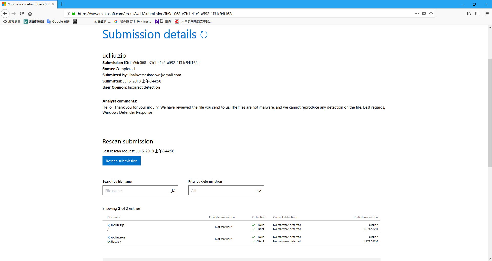

# UCL_LIU
利用python+pyhook開發的仿蝦米，肥米輸入法 
 

  
  

 
作者：羽山秋人 (<a target="_blank" href="http://3wa.tw">http://3wa.tw</a>) 
信箱：<a target="_blank" href="mailto:uclliu.3wa@gmail.com">uclliu.3wa@gmail.com</a> 
 
最初開發日期：2017-06-16 11:24 
最後更新日期：2018-07-14 12:22
 
版本：V 1.13 
 
下載位置： 
　　1.主程式：<a download="uclliu.exe" target="_blank" href="https://raw.githubusercontent.com/shadowjohn/UCL_LIU/master/dist/uclliu.exe">https://raw.githubusercontent.com/shadowjohn/UCL_LIU/master/dist/uclliu.exe</a> 
　　2.同音字庫：<a download="pinyi.txt" target="_blank" href="https://raw.githubusercontent.com/shadowjohn/UCL_LIU/master/dist/pinyi.txt">https://raw.githubusercontent.com/shadowjohn/UCL_LIU/master/dist/pinyi.txt</a> 
　　3.字根檔(liu-uni.tab、liu.cin、liu.json) 因版權問題無法提供  
 
 
開發動機： 
　　吃飽閒閒覺得人生就是該自己寫一套輸入法，然後就開始寫了。 
字碼表說明： 
　　　　由於字碼表的版權問題爭議，就不放 liu.json 了，liu.json 的格式同PIME的架構。 
　　要好的字碼表的話，請買正版，將 tab->cin->json  
　　雖然很麻煩，但沒人想因為實作一套輸入法就被告翻。 
　　 
　　P.S: 請不要使用守義大學FTP裡的那個 liu-uni.tab ，太古早了，而且有些字根都錯的!
　　 
　　首次使用如果沒有liu.json，會自動進行 tab->cin->json的轉換，tab會自動查找C:\windows\Syswow64\liu-uni.tab 或 C:\\Program Files\\BoshiamyTIP\\liu-uni.tab 或 同目錄下的tab檔。 
    
    (2018-03-22) V1.2 版，可支援 fcitx 裡的嘸蝦米表格：
    fcitx-table-boshiamy，如要使用fcitx-table-boshiamy，下載 boshiamy.txt 改名成 fcitx_boshiamy.txt 跟主程式放一起，
    就可以把fctix_boshiamy.txt 轉成 liu.cin，再轉 liu.json 來使用。
    我加了點程式碼，順手把日文的部分修正，原本打 a, = あ，但在 fcitx 要打 ja, 才會出 あ，如果只有打 a, 好像有些亂碼~_~
    反正就修正了~
    
    (2018-03-27) V1.2 版：
    修正「英/全」一些按鍵如 win、ctrl、enter 等問題
    將 cintojson.py 整支重寫，改成此輸入法需要的部分，初始化 cin -> json 速度就不會像以前那麼慢了! 
    
    (2018-04-05) V1.3 版：
    修正 putty 在 vim 時，打中文無法正常出字的問題
    
    (2018-04-08) V1.4 版：
    支援 Terry_Yong 的 泰瑞版小小輸入法，將 terry_yong.zip 解開，資料夾 mb 裡的 Boshiamy.txt 改名成 terry_boshiamy.txt 跟主程式放一起，
    就可以把terry_boshiamy.txt 轉成 liu.cin，再轉 liu.json 來使用。
    此版本筆者測試後，發現無日文，如果不需使用日文是勘用。

    (2018-04-11) V1.5 版：
    將「英/半」的半透明無置頂，改成置「底」，其他狀況「置頂」
    改寫gtk.main() 改成 gtk.main_iteration(False) 來處理 UI 更新
    (感謝老炳幫忙測置頂的bug)
    
    (2018-04-21) 補充說明：
    因為最近在使用，發現肥米自己關閉，然後整個exe檔消失，查了一下發現被 Windows Defender 誤判為病毒了
    Trojan:Win32/Fuery.A!cl、HackToo:Win32/Keygen
    就把uclliu.exe上傳至微軟自清送驗~
    https://www.microsoft.com/en-us/wdsi/submission/70669843-8642-4b61-bdb2-561243f78af6
    等了約1小時，就收到 Final determination : Not malware
    
    (2018-05-05) V1.6 版：
    (修正)右邊數字鍵的 . 直接輸出即可
    (修正)移除uclliu_debug，改用 -d 即可進入 debug 模式
    調整 UI 顯示字型大小
    
    (2018-05-08) V1.7 版：
    (修正)正常模式的字體初始時大小錯誤         

    (2018-06-25) V1.8 版：
    支援RIME afrink 分享的 liur_trad.dict.yaml 字根表

    (2018-07-04) V1.9 版：
    增加 ,,,x 與 ,,,z 的功能，在「肥」模式下，反白文字：
    利用 ,,,x 可以將「文字→字根」，如「肥的好→ucl d gz」
    利用 ,,,z 可以將「字根→文字」，如「ucl d gz→肥的好」
    
    (2018-07-06) 補充說明：
    微軟的　Windows Defender 更新後誤判程式是病毒，詳見：screenshot/uclliu_save1.png
    已提交，判定為 Not malware ，真麻煩 :(

    (2018-07-09) V1.10 版：
    移除用不到的 win32com、win32com.client 整個執行檔變小了^_^
    加速、修正 ,,,x、,,,z 使用 thread 來出字，防止多按一個 z 或 x 的問題
    修正 ,,,x 大小寫都可以使用 
    
    (2018-07-12) V1.11 版：
    可以使用 ,,,c、,,,t 來切換「簡體/繁體」輸入。 
    感謝臺灣碼農的簡繁對照表 https://ithelp.ithome.com.tw/articles/10196695
    
    (2018-07-12) V1.12 版：
    可紀錄最後 UI 擺放的位置在 C:\temp\UCLLIU.ini
    增加使用 ,,,s 將肥米 UI 變窄
    增加使用 ,,,l 將肥米 UI 變寬
    增加使用 ,,,+ 將肥米 UI 變大
    增加使用 ,,,- 將肥米 UI 變小
    UCLLIU.ini 裡 ZOOM 可設定 0.1 ~ 1.0 來改變 肥 模式下透明度
                    
 
開發工具： 
  <ul>
    <li>Python 27 (32BIT)</li>
    <li>pyhook</li>
    <li>pygtk</li>
    <li>pywin32</li>
    <li>pyinstaller 可搭配build.bat製作dist/uclliu.exe檔</li>
    <li>psutil 用來判斷目前視窗跑什麼，如果是putty、pietty、pcman出字方式要調整</li>
    <li>(Third party) php.py 羽山比較熟php，所以在python裡實作很多php的函式</li>
    <li>(Third party) portalocker.py 防重複執行，會Lock c:\temp\UCLLIU.lock</li>
    <li>(Third party) SendKeysCtypes.py 可以送出Unicode的SendKeys</li>
    <li>(Third party) liu_unitab2cin.py 可以將tab轉成cin的檔案，改成支援python2.7的寫法</li>
    <li>(Third party) cintojson.py 可以將cin轉成json的檔案，改成支援python2.7的寫法</li>
    <li>(Third party) cin\phone.cin 同音字表參考新酷音的傳統注音表:https://raw.githubusercontent.com/google/jscin/master/src/tables/phone.cin</li>
    <li>字碼表亦可參考PIME裡的liu.json</li>
</ul>
 
檔案說明： 
  <ul>
    <li>Python 27 (x86版本):【https://www.python.org/ftp/python/2.7.13/python-2.7.13.msi】</li>
    <li>請設定windows環境變數，在path裡加上 【;c:\Python27;c:\Python27\Scripts】
    <li>pyhook【放在p27目錄，點了安裝即可 p27/pyHook-1.5.1.win32-py2.7.exe】</li>
    <li>pygtk 【放在p27目錄，點了安裝即可 p27/pygtk-all-in-one-2.24.1.win32-py2.7.msi】</li>
    <li>pywin32 【放在p27目錄，點了安裝即可 p27/pywin32-221.win32-py2.7.exe】</li>    
    <li>pyinstaller 可搭配build.bat製作dist/uclliu.exe檔【pip install pyinstaller】</li>
    <li>psutil 用來判斷目前視窗跑什麼，如果是putty、pietty、pcman出字方式是貼上，【pip install psutil】</li>
    <li>configparser config UCLLIU.ini 需要用來解 ini 的工具【pip install configparser】</li>
    <li>(Third party) php.py 羽山比較熟php，所以在python裡實作很多php的函式</li>
    <li>(Third party) portalocker.py 防重複執行，會Lock c:\temp\UCLLIU.lock</li>
    <li>(Third party) SendKeysCtypes.py 可以送出Unicode的SendKeys</li>
    <li>(Third party) liu_unitab2cin.py 可以將tab轉成cin的檔案，改成支援python2.7的寫法</li>
    <li>(Third party) cintojson.py 可以將cin轉成json的檔案，改成支援python2.7的寫法</li>
    <li>(Third party) cin\phone.cin 同音字表參考新酷音的傳統注音表:https://raw.githubusercontent.com/google/jscin/master/src/tables/phone.cin</li>
    <li>字碼表亦可參考PIME裡的liu.json</li>
  </ul>
 
自行編譯： 
  <ul>
    <li>1、請下載並安裝python 27 (x86版) 【https://www.python.org/ftp/python/2.7.13/python-2.7.13.msi】</li>
    <li>2、請設定windows環境變數，在path裡加上 【;c:\Python27;c:\Python27\Scripts】</li>
    <li>3、安裝【p27/pyHook-1.5.1.win32-py2.7.exe】</li>
    <li>4、安裝【p27/pygtk-all-in-one-2.24.1.win32-py2.7.msi】</li>
    <li>5、安裝【p27/pywin32-221.win32-py2.7.exe】</li>
    <li>6、至windows cmd，下指令【pip install psutil】</li>
    <li>7、至windows cmd，下指令【pip install pyinstaller】</li>
    <li>8、至windows cmd，下指令【pip install configparser】</li>
    <li>9、將買來的嘸蝦米，找到 liu-uni.tab，dist裡提供的pinyi.txt 與主檔 uclliu.pyw 放在一起</li>
    <li>10、執行【python uclliu.pyw】可以跑出程式</li>
    <li>11、編成exe的方法，執行【build.bat】，即可將 uclliu.exe 編到 dist 目錄下</li>
    <li><s>12、build_debug.bat 是方便debug用的版本，運行時還會保留command介面</s></li>
    <li>12、執行肥米時【python uclliu.pyw -d】可以進入 debug模式，讓 log 訊息在命令提示窗中呈現</li>
  </ul>
 

使用方法： 
　　1、您可以只下載dist/uclliu.exe 
　　2、將 「liu-uni.tab 或 liu.cin 或 liu.json」任一種檔案 與 uclliu.exe 放一起 
　　3、執行 uclliu.exe 即可開始使用 
　　4、首次執行，系統會自動將tab轉成liu.cin，然後自動會再把liu.cin轉成liu.json，需要花大概30秒~1分鐘的時間，之後有liu.json就可以快速開啟。     
　　5、未來使用的話，就把uclliu.exe、作好的字根檔liu.json帶著走，四處都能打肥米輸入法了A_A  
　　(還是要再強調一次，不要用義守大學FTP裡的那個liu-uni.tab，建議可以安裝正版嘸蝦米後在C:\windows\Syswow64裡找到)
　　(新版的嘸蝦米，liu-uni.tab可能會放在 C:\Program Files\BoshiamyTIP 這裡面) 
　　6、如果需要使用如「'ucl」這種同音字查詢，請將 dist\pinyi.txt 也與uclliu.exe 放一起 
　　7、增加一個遊戲模式的按鈕，只要按「,,,lock」就會變成遊戲模式，再按「,,,unlock」回到正常模式，這樣玩CS殺人時就可以消音走路了 
　　8、增加版本查詢功能，只要按「,,,version」，就會跳出版本提示
 
 
微軟 Windows Defender 誤判與回報：

由於此程式以 pyhook (keyhook) 方式開發，容易被防毒軟體誤判成病毒，已提供微軟進行病毒排除，正常只需要把 Windows Defender 病毒碼更新，啟動時就不會被封鎖了。
 

ToDo： 
<ul>
  <li>(Done)1、(嚴重)「送出字元」的方法，試了很多send key一直無法解決 send unicode的問題，暫時使用「剪貼簿」的Ctrl+V來實作貼上文字的功能</li>
  <li>(Done 2017-07-16)2、「英文全形」輸入時，有些組合鍵如 Alt+tab還尚未決定</li>
  <li>(Done)3、py2exe包成一支exe改用pyinstaller代替</li>
  <li>4、尚有些按鍵會讓「英/肥」切來切去，暫未處理</li>
  <li>(Done)5、離開程式的按鈕</li>
  <li>(Done)6、支援V鍵選第二個字</li>
  <li>(Done)7、「」【】這種框框應該也要支援</li>
  <li>(Done)8、sendkey時，判斷window id，如果該id是putty、pcman，改成shift+ins作文字貼上</li>
  <li>(Done)9、「英/半」時，加上調整opacity值，讓肥米變透明(Opacity 0.2)</li>
  <li>(Done)10、增加提示沒有liu.json時的錯誤警告</li>
  <li>11、輸出字後，可以[提示簡根字]，以便提升打字速度</li>
  <li>(Done 2017-07-18)12、同音字查詢，使用 pinyi.txt</li>
  <li>(Done 2017-07-12)13、寫一篇如何把tab->cin->json的教學(已有自動轉檔了)</li>
  <li>(Done)14、支援把tab跟UCLLIU放一起就可以自動使用、轉檔的功能</li>
  <li>15、缺碼查詢，如lom[、lom]</li>
  <li>(Done 2017-07-15)16、在「英/全」的模式時，無法按 Shift 切換回「肥/全」</li>
  <li>(Done 2017-07-31)17、在「肥/全」的「冒號、分號、空白」應該是要出全形字</li>
  <li>18、tab->cin->json有點久，所以預計再加一個字根檔轉換中的進度畫面</li>
  <li>(Done 2017-07-13)19、V鍵出字，有些字如果V是尾根，會有打不出來的問題，如「截」jaqv，會變成「戟」，「截」會完全打不出來。回(oov)，變成要打「ooo2」</li>
  <li>(Done 2017-07-13)20、修正打錯字根時，後面的字沒清掉的問題</li>
  <li>(Done 2017-07-13)21、修正用滑鼠點「肥/英」時，字根未清除的問題</li>
  <li>(Done 2017-07-13)22、修正pcman出字的問題，貼在上時設一下delay才不會貼的時候剪貼簿的東西一直跑出來</li>
  <li>23、增加啟動時版本提示，有助於確認目前版本，之後版號會開始增加</li>
  <li>(Done 2017-07-14)24、修正全螢幕下，如看影片，下排工作列佔著畫面的問題，去除肥米執行時下方多一個taskbar</li>
  <li>(Done 2017-07-17)25、字根不可超過五碼</li>
  <li>(Done 2017-07-16)26、英/全時，修正刪除鍵可以正常使用</li>
  <li>(Done 2017-07-17)27、在錯誤的字碼按下空白鍵，會刪掉已輸入的字碼，且游標不會前進</li>
  <li>28、切到「肥」模式時，系統應自動強制切換輸入法為「Eng」</li>
  <li>(Done 2017-07-18)29、同音字過多分頁的問題，要支援按空白鍵下頁</li>
  <li>(Done 2017-07-31)30、首次執行uclliu.exe時，如果連續執行uclliu.exe，會造成在轉換cin、json發生異常</li>
  <li>(Done 2017-07-31)31、支援新版嘸蝦米liu-uni.tab放置位置 C:\Program Files\BoshiamyTIP\liu-uni.tab</li>
  <li>(Done 2017-08-02)32、「肥」模式時，當按著win鍵+英文，應該要允許出字，不然無法按如 win+r 這種功能</li>  
  <li>(Done 2017-09-13)33、刪掉一些php.py裡用不到的函式，可以讓uclliu.exe檔變小一些</li>
  <li>34、支援Linux、Mac的研究(下一次吃飽閒閒再說)</li>                                           
  <li>(Done 2017-09-24)35、「英/半」模式時，切換「英/全」應該要從半透明變顯示</li>
  <li>(Done 2017-09-24)36、增加遊戲模式使用情景，按,lock變成遊戲模式，按,unlock回到正常模式</li>
  <li>(Skip 2018-03-22)37、支援「瑲珩版嘸蝦米表格」沒找到這個版本的嘸蝦米表格</li>
  <li>(Done 2018-03-22)38、支援「fcitx裡的嘸蝦米表格」</li>
  <li>(Done 2018-04-08)39、支援「泰瑞版小小輸入法」</li>
  <li>(Done 2018-07-12)40、支援「簡體模式 ,,,c / ,,,t 切換」</li>
  <li>(Done 2017-10-20)41、修正郵局三加二程式無法輸入的問題</li>
  <li>(Done 2017-10-24)42、修正「肥/全」模式時，部分全形字只出半形的問題</li>
  <li>(Done 2017-10-24)43、修正Shift+右邊數字上下左右，輸入法會變來變去的問題</li>
  <li>(Done 2017-10-24)44、增加Debug參數，減少背景無意義print浪費CPU</li>
  <li>(Done 2017-10-25)45、修正XYplorer.exe程式無法輸入的問題</li>
  <li>46、出字後的「選詞功能」，如: 我，會出現「們、的、…」</li>
  <li>47、點到輸入框，最後focus會在「輸入框」導致輸入文字沒指定到原本的輸入視窗，放開輸入框後，「焦點」要回到最後離開的視窗。</li>
  <li>(Done 2018-02-12)48、偵測到不能用的liu-uni.tab，會提示無法使用，如義守大學ftp那個版本，版友傳來的</li>
  <li>(Done 2018-02-12)49、增加版本提示功能</li>
  <li>(Done 2018-02-23)50、同修正6，支援 VRSF 對應 1234 字功能</li>
  <li>(Done 2018-03-27)51、自己重寫cin->json (cintojson.py) 這段的程式碼，速度太慢</li>
  <li>(Done 2018-03-27)52、修正「英/全」時的Enter有bug</li>  
  <li>(Done 2018-04-05)53、修正 putty 裡 vim 裡打中文字的問題</li>
  <li>(Done 2018-04-05)54、修正 putty 裡 vim 裡打中文字的速度</li>  
  <li>(Done 2018-04-11)55、修正UI置頂的問題</li>
  <li>(Done 2018-05-05)56、右邊數字鍵的 . 直接輸出即可</li>
  <li>(Done 2018-05-05)57、移除uclliu_debug，改用 -d 即可進入 debug 模式</li>
  <li>(Done 2018-05-05)58、調整顯示字型大小</li>
  <li>(Done 2018-05-08)59、正常模式的字體初始時大小錯誤</li>
  <li>(Done 2018-06-25)60、支援RIME afrink 整理的 liur_trad.dict.yaml</li>
  <li>(Done 2018-07-04)61、增加功能反白蝦米英文字解中文，如：eee ei gz ucl，在「肥」模式下，按「,,,x」會變成「羽山好肥」</li>
  <li>(Done 2018-07-04)62、增加功能反白中文字轉蝦米英文字，如：羽山好肥，在「肥」模式下，按「,,,z」會變成「eee ei gz ucl」</li>  
  <li>(Done 2018-07-04)63、修正 ,,,z 切字的函式</li>
  <li>(Done 2018-07-09)64、修正 ,,,x 大小寫都可以使用的問題</li>
  <li>(Done 2018-07-09)65、加速 ,,,x、,,,z 的轉換速度</li>
  <li>(Done 2018-07-09)66、移除 import win32com、win32com.client 整個 uclliu.exe 變小一些</li>
  <li>(Done 2018-07-13)67、增加 C:\temp\UCLLIU.ini 設定檔，記錄最後視窗移動位置 X、Y、ALPHA、SHORT_MODE、ZOOM</li>  
  <li>(Done 2018-07-14)68、修正 kinza 瀏覽器裡 ptt 打字無法正常的問題</li>
  <li>69、「英/全」時的 ESC 鍵沒有正常的吐出 ESC 的問題，如無法關閉 Line 視窗</li>  
</ul>
 
版權： 
　免錢的 MIT-License
