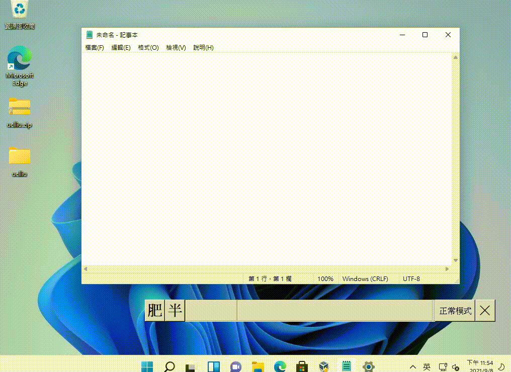
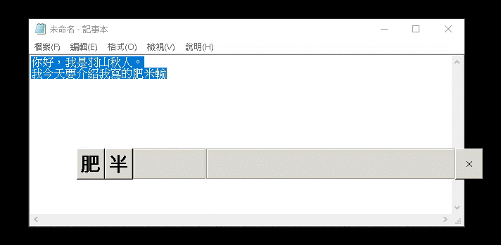
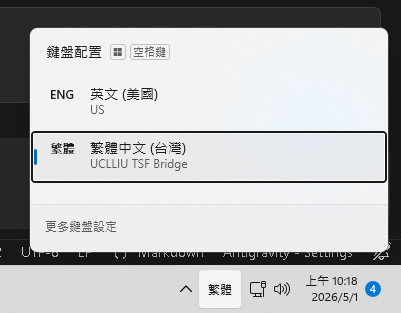
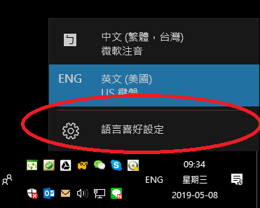
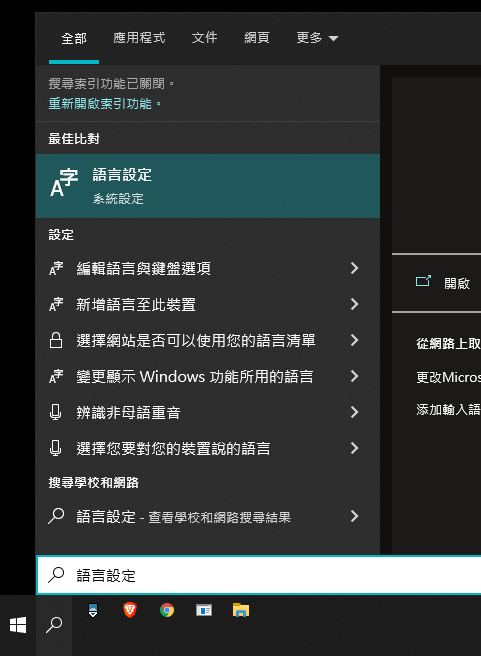
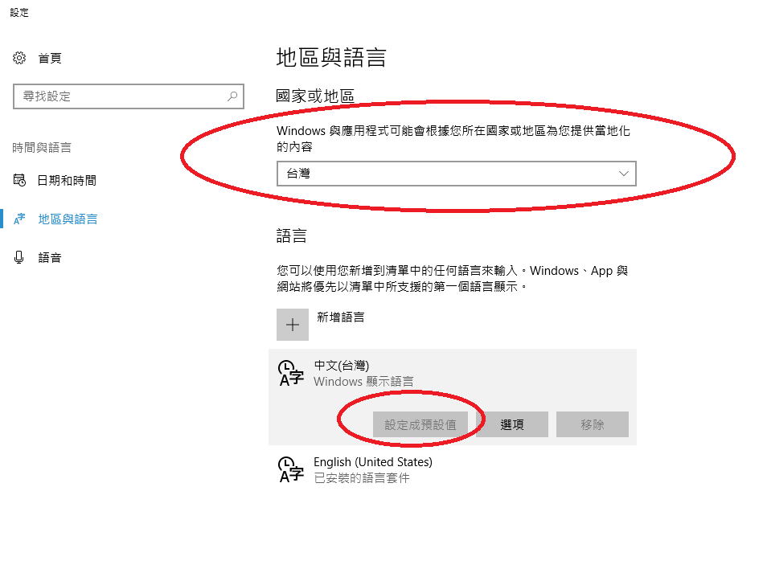
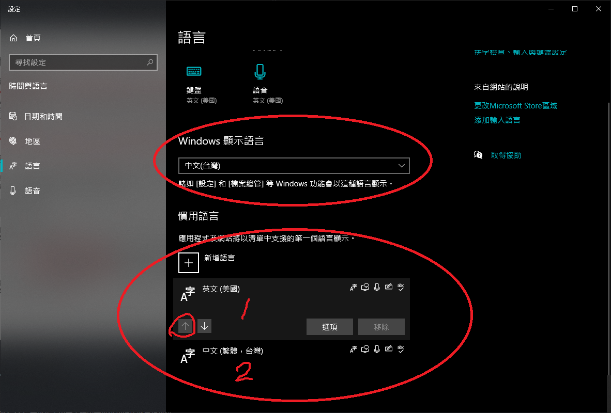
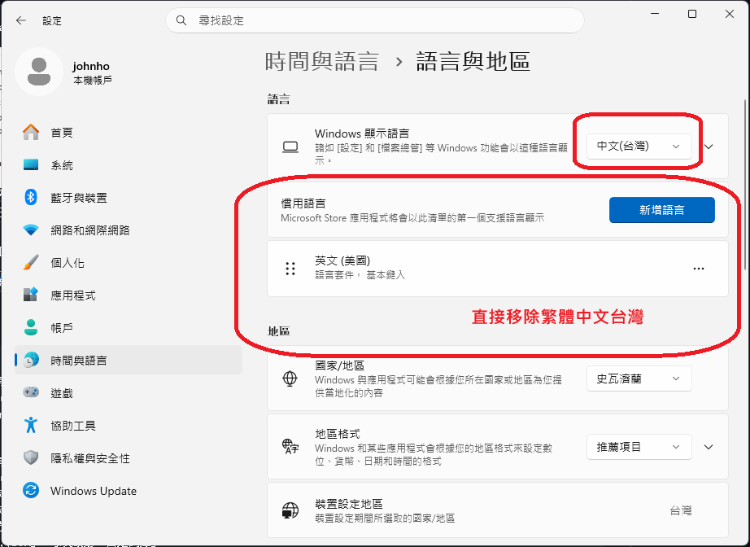

# 🍙 UCL_LIU (肥米輸入法)

[](https://github.com/shadowjohn/UCL_LIU/releases)
[](./MIT-License)
[](https://github.com/shadowjohn/UCL_LIU)

**利用 Python + PyHook 開發的仿蝦米輸入法，旨在提供穩定、輕量且高度自定的輸入體驗。**

---

<div align="center">
  
  <p><i>測試在 Windows 11 下正常運作</i></p>
  
  
  
  
  <p>
    <a href="https://youtu.be/ClSbkHDqkOs">📺 觀看介紹影片</a>
  </p>

  <br>
  <b>使用 TSF 出字模式時，請記得將 Windows 輸入法切換為「UCLLIU TSF Bridge」</b>
</div>

---

## 🚀 快速開始 (Download)

> [!IMPORTANT]
> **提醒：** 如果遇到無法正常出字的視窗，請嘗試將肥米輸入法關閉，點擊右鍵選擇 **「以系統管理員身分執行」**。

| 檔案名稱 | 下載連結 | 說明 |
| :--- | :--- | :--- |
| **uclliu.exe** | [立即下載](https://raw.githubusercontent.com/shadowjohn/UCL_LIU/master/dist/uclliu.exe) | v1.67 Beta 主程式 (建議使用) |
| **uclliu.zip** | [立即下載](https://raw.githubusercontent.com/shadowjohn/UCL_LIU/master/dist/uclliu.zip) | v1.67 Beta 壓縮版 |
| **穩定版 (v1.66)** | [exe](https://raw.githubusercontent.com/shadowjohn/UCL_LIU/master/RELEASE/1.66/uclliu.exe) / [zip](https://raw.githubusercontent.com/shadowjohn/UCL_LIU/master/RELEASE/1.66/uclliu.zip) | 穩定版備份 |
| **同音字庫** | [pinyi.txt](https://raw.githubusercontent.com/shadowjohn/UCL_LIU/master/dist/pinyi.txt) | 放在 exe 旁即可啟用同音字查詢 |
| **打字音效** | [wavs.zip](https://raw.githubusercontent.com/shadowjohn/UCL_LIU/master/wavs/wavs.zip) | 解壓後將 `0~9.wav` 與 exe 放一起 |

*註：因版權問題，不提供字根檔 (`liu-uni.tab`, `liu.cin`, `liu.json`)，請自行準備。*

---

## ✨ 核心特色

### 🌉 TSF Bridge 出字模式 (實驗性)
為了解決現代應用程式 (如 Chrome, Edge, VS Code, Line) 在傳統模擬輸入模式下上字不穩定或光標跳動的問題：
1. 在選單開啟「TSF 出字模式」。
2. 將 Windows 右下角輸入法切換為 **「UCLLIU TSF Bridge」**。
3. 享受如原生輸入法般的穩定上字體驗。
*（初次使用需管理員權限進行註冊，出字失敗會自動 Fallback 回原本流程）*

### 🎮 遊戲模式 (`,,,lock`)
針對遊戲環境（如 CS:GO），當需要按住 Shift 消音走路時，避免觸發輸入法切換。

### 📝 強大的字根支援
支援多種來源的字碼表：
- 官方 7.0.4 / 7.0.5 / 嘸蝦米 J (`liu-uni.tab`)
- PIME / RIME 字根表 (`liu.json`, `liur_trad.dict.yaml`)
- fcitx / 泰瑞版小小輸入法表格 (`boshiamy.txt`)
- 支援韓語字根與 CJK 特殊符號

---

## 🛠️ 使用與安裝

1. **基本安裝**：
   - 下載 `uclliu.exe`。
   - 將 `liu-uni.tab` 或 `liu.cin` 或 `liu.json` 任一檔案與 `uclliu.exe` 置於同一目錄。
   - 執行 `uclliu.exe`。首次執行會自動進行轉檔（約 30~60 秒）。
2. **同音/注音查詢**：
   - 下載 `pinyi.txt` 並置於同目錄。
   - 使用「`'ucl`」查詢同音字。
   - 使用「`';zo6`」進入注音查詢模式。
3. **熱鍵說明**：
   - `,,,unlock`：回到正常模式
   - `,,,lock`：進入遊戲模式
   - `,,,c` / `,,,t`：切換簡體/繁體
   - `,,,s` / `,,,l` : UI 縮窄/拉寬
   - `,,,+` / `,,,-` : UI 放大/縮小
   - `,,,x` / `,,,z` : 反白文字進行「字根轉文字」或「文字轉字根」

---

## ⚙️ 環境設定與 FAQ

### 建議的語言設定 (Windows 10/11)
強烈建議安裝「ENG (United States)」語系，並將其上移至第一順位，這樣打字時就不會被微軟新注音干擾。
<details>
<summary>點擊展開圖解說明</summary>

<br>
<br>
<br>
<br>
<br>
<br>
*在 Win11 中甚至可以直接移除微軟注音，只留 ENG 與肥米，體驗最清爽。*
</details>

### `UCLLIU.ini` 設定說明
| 參數 | 說明 |
| :--- | :--- |
| `short_mode` | 是否為短版模式 (0/1) |
| `zoom` | UI 縮放大小 (如 0.90) |
| `send_kind_1_paste` | 設定特定程式 (如 putty.exe) 強制使用「複製貼上」出字 |
| `tsf_bridge_enable` | 是否啟用 TSF Bridge (0/1) |
| `play_sound_enable` | 打字音效開關 |

---

## 👨‍💻 開發者資訊

### 技術棧 (Tech Stack)
- **Python 2.7 (32-bit)**: 核心邏輯
- **PyGTK**: UI 介面
- **PyHook / PyWin32**: 按鍵攔截與視窗控制
- **TSF Bridge (C++)**: 支援 Windows Text Services Framework

### 自行編譯 (Build)
1. 安裝 Python 2.7.13 (x86) 並設定環境變數。
2. 安裝 `p27/` 目錄下的所有依賴組件。
3. 執行 `pip install psutil configparser pyaudio pyinstaller==3.4`。
4. 執行 `build.bat` 產出 `dist/uclliu.exe`。
5. TSF Bridge 編譯：執行 `build_tsf.bat` (需 VS 2022 C++ 環境)。

---

## 📜 更新記錄與計畫

### 最近更新 (v1.67)
- **實驗性 TSF Bridge**：解決 Chrome/Edge/VS Code 等程式上字不穩問題。
- **自動診斷**：啟動時自動檢查 DLL 狀態，失敗自動 Fallback。
- **管理功能**：新增 TSF 管理選單，可隨時註冊或解除註冊。
- **權限導引**：新增「以管理員身分重啟」選單功能。
- **病毒掃描**: https://www.microsoft.com/en-us/wdsi/submission/464890a2-68c0-4cd7-83ae-5205ed0ecea4

<details>
<summary><b>查看完整歷史更新記錄</b></summary>

```text
(2025-12-23) v1.66 版：
1. 205、chrome 瀏覽 term.ptt.cc 有時標題會變成 ws.ptt.cc，導致出字失敗

(2025-10-30) v1.65 版：
1. 198、自定詞庫字體顯示支援「🅅 U+1F145」、「☒ U+2612」
2. 199、自定詞庫視窗左上角，顯示「肥」Icon
... (此處省略數百行，詳見下方原始歷史區)
```
</details>

---

## 📝 原始詳細說明備存 (包含所有寶貴資料)

<details>
<summary>點擊展開詳細技術說明、FAQ 與 ToDo List</summary>

### 目前支援的字碼表來源：
1. 官方 7.0.4 / 7.0.5 / 嘸蝦米 J (`liu-uni.tab`)
2. PIME `liu.json`
3. fcitx 嘸蝦米表格
4. 泰瑞版小小輸入法
5. RIME 字根表
...等

### 開發工具與依賴：
- Python 27 (32BIT)
- pyhook, pygtk, pywin32
- psutil, pyaudio
- (Third party) php.py, portalocker.py, SendKeysCtypes.py
- (Third party) liu_unitab2cin.py, cintojson.py

### 完整歷史更新記錄：
詳細的版本演進記錄請參閱 [CHANGELOG.md](./CHANGELOG.md)。

### ToDo List：
- [x] (Done) 送出字元方法優化
- [x] (Done) 遊戲模式
- [x] (Done) 同音字查詢
- [ ] (137) 相關字詞推薦功能
- [ ] (174) 表情、符號快選選單
</details>

---

### 💖 致謝
感謝 **Benson9954029** 與所有回報問題的網友 (klt, Chuanhuan, ym, Allen, robert820, hrcspkla 等)。

**作者：** [羽山秋人 (3wa.tw)](https://3wa.tw) / [Benson9954029](https://github.com/Benson9954029)
**信箱：** [uclliu.3wa@gmail.com](mailto:uclliu.3wa@gmail.com)
**版權：** 完全免費的 MIT-License
